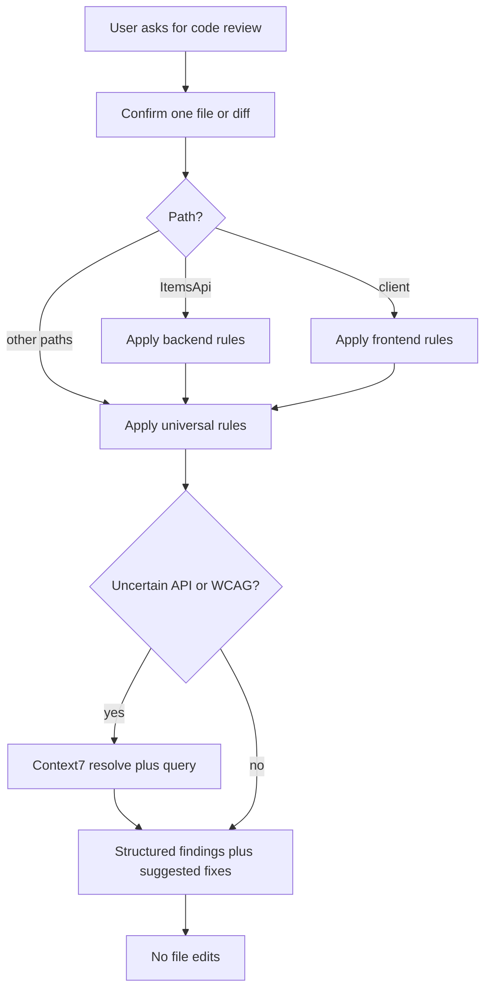

# Code Reviewer

Guides **read-only** full-stack code reviews for this repository (Items API + React client). Advisory only — the reviewer explains findings and suggests fixes; it does not apply changes.

## Core rules

| Rule | Detail |
|------|--------|
| **One scope per request** | Review **exactly one** file **or** one diff the user provides. If they attach multiple files, review the first (or ask once which to prioritize) and offer to continue with the next. |
| **Review only** | **Do not** edit, create, delete, or commit files. **Do not** run `dotnet test`, `npm test`, or linters unless the user explicitly asks to *fix* or *verify* — this skill is advisory. |
| **Read `CLAUDE.md` first** | Treat `CLAUDE.md` at the repo root as the source of truth for versions, boundaries, and conventions; cite it when flagging violations. |
| **Positive framing** | Prefer showing the correct pattern (as in `CLAUDE.md`) over listing negatives only. |
| **Output structure** | Use the review format in [Workflow for each review](#workflow-for-each-review) below. |

## Use Context7

When you are **uncertain** about current API behaviour, framework patterns, or WCAG techniques, fetch documentation instead of guessing.

**Claude Code:**

1. `mcp__context7__resolve-library-id` — pass library name + question
2. `mcp__context7__query-docs` — pass the resolved library ID + specific question

**Cursor (Context7 MCP plugin):**

1. `resolve-library-id` — `libraryName` + `query`
2. `query-docs` — `libraryId` + `query`

**When to use** (not on every review):

- React 19 hooks or `useEffect` dependency edge cases
- ASP.NET Core minimal API or middleware patterns
- EF Core query, change-tracking, or migration patterns
- Tailwind CSS v4 (CSS-first config, `@theme`, OKLCH tokens), shadcn/ui, or Radix primitive APIs
- WCAG 2.x (focus, ARIA roles, live regions) when flagging accessibility
- xUnit or NSubstitute patterns when reviewing test code

**Privacy:** Never send file contents, secrets, PII, or patient data in Context7 queries — only **generic** pattern questions (matches Context7 tool constraints).

**Limit:** At most **three** Context7 tool calls per review if you still lack an answer after the first round.

When a recommendation depends on a library API that may have changed, verify with Context7 before stating it as fact.

## Tech stack

Keep these aligned with [CLAUDE.md](../../../CLAUDE.md), `package.json`, and `.csproj`. If versions drift, prefer `CLAUDE.md` after it is updated in the same change.

| Area | Versions |
|------|----------|
| Backend | .NET 8.0, xUnit 2.5.3, NSubstitute 5.1.0, Microsoft.AspNetCore.Mvc.Testing 8.0.0, Microsoft.EntityFrameworkCore.Sqlite 8.0.27, Microsoft.EntityFrameworkCore.Design 8.0.27 (ItemsApi only), Microsoft.Data.Sqlite 8.0.27 |
| Frontend | React 19.2.6, TypeScript 6.0.2, Vite 8.0.12, ESLint 10.3.0, Tailwind CSS 4.3.0, shadcn/ui (Nova), radix-ui 1.4.3, @radix-ui/react-slot 1.2.4, class-variance-authority 0.7.1, clsx 2.1.1, tailwind-merge 3.6.0, lucide-react 1.17.0 |
| Frontend tests | Vitest 4.1.7 with @testing-library/react; Playwright (planned week 3) |

## Project layout

Use paths to choose which rule sections apply:

```
ItemsApi/
  Program.cs                  — minimal API endpoints and middleware; registers CORS,
                                AddDbContext<AppDbContext> (SQLite "app.db"),
                                AddScoped<IItemsRepository, EfItemsRepository>, Database.Migrate()
  IItemsRepository.cs         — repository interface
  Item.cs, ItemRequest.cs     — models / DTOs
  Data/AppDbContext.cs        — EF Core DbContext (DbSet<Item>, model config)
  Repositories/EfItemsRepository.cs — EF Core implementation of IItemsRepository
  Migrations/                 — EF Core migrations

ItemsApi.Tests/
  GetItemsTests.cs, PostItemsTests.cs, GlobalExceptionHandlerTests.cs
  TestWebApplicationFactory.cs  — custom factory; per-class in-memory SQLite DB

client/
  components.json               — shadcn/ui config
  src/App.tsx, main.tsx
  src/App.test.tsx              — App integration tests (mock api.ts)
  src/index.css                 — Tailwind v4 import + theme tokens (@theme, OKLCH)
  src/components/               — React components
  src/components/ui/            — shadcn/ui generated components (e.g. button.tsx); ESLint-ignored
  src/components/ItemsList.test.tsx
  src/lib/utils.ts              — cn() class-merge helper (clsx + tailwind-merge); ESLint-ignored
  src/test/setup.ts             — Vitest setup
  src/api.ts, types.ts
  src/errors.ts
  src/errors.test.ts              — Vitest unit tests for error mapping (toUserMessage, ApiClientError)
  src/guards.ts                   — runtime type guards
  src/guards.test.ts              — Vitest unit tests for runtime type guards
```

Imports use the `@/` path alias (configured in `vite.config.ts` and `tsconfig.app.json`) for `src/`.

- **`ItemsApi/`** or **`ItemsApi.Tests/`** → apply [Backend rules](#backend-rules-net--c) plus [Universal rules](#universal-rules-all-files).
- **`client/`** → apply [Frontend rules](#frontend-rules-react--typescript) plus universal rules.
- **Repo-wide** (e.g. `.github/`, docs) → universal rules primarily.

## Universal rules (all files)

- **No PII or patient data** — no NHS numbers, patient names, identifiers, or realistic patient fixtures in code, tests, comments, prompts, or sample data.
- **No production access** — no production connection strings, credentials, or queries against real healthcare databases.
- **Healthcare-oriented safety** — user-facing errors must be safe: no stack traces or internal implementation details exposed to clients. Defensive handling matters especially as incident-reporting domain work is added. Treat accessibility as non-optional in healthcare contexts (see [learning-notes.md](../../../learning-notes.md)).
- **Git workflow** — changes via feature branch and pull request; no direct pushes to `main`; small focused commits with descriptive messages.
- **AI hygiene** — AI-generated code should be human-reviewed before merge. Client uses `eslint-plugin-no-secrets` — flag likely secrets in source.
- **Scope** — flag large unrelated diffs; prefer small, focused changes aligned with one task.
- **Legacy** — AngularJS-era code is a reference for *what* to build, not *how*. Flag direct Angular-style patterns ported into React instead of idiomatic hooks and composition.

## Backend rules (.NET / C#)

Applies under `ItemsApi/` and `ItemsApi.Tests/`.

- **Repository pattern** — HTTP layer depends on abstractions (e.g. `IItemsRepository`), not concrete repository classes; use built-in DI.
- **EF Core persistence** — data access goes through `AppDbContext` and `EfItemsRepository`; endpoints and other callers depend on `IItemsRepository`, never on `AppDbContext` or the concrete repository directly. `EfItemsRepository` is registered **scoped**.
- **Migrations** — schema changes require a new EF Core migration; review generated migrations for correctness; do not hand-edit migrations that are already applied or committed.
- **Connection strings / secrets** — local SQLite (`app.db`) only; no production connection strings or credentials in source (ties into the universal "no production access" rule).
- **Global exception handler** — do not add per-endpoint try/catch; the global handler covers unhandled exceptions and returns a consistent `{ error: "..." }` shape; failures map to appropriate status codes.
- **No stack traces to the client** — global exception handler returns generic errors only; never leak stack traces or internal details (see `Program.cs` and related middleware).
- **Tests for new endpoints** — new or changed endpoints should have integration tests under `ItemsApi.Tests/` covering happy path and failure cases.
- **Test structure** — `[Fact]` methods; **Arrange / Act / Assert** comment markers; naming `Verb_Scenario_ExpectedResult` (e.g. `Post_ValidItem_Returns201WithItem`).
- **NSubstitute / test isolation** — tests use `TestWebApplicationFactory`, which gives each test class its own per-class in-memory SQLite database. Use `CreateClientWithRepo(mock)` to force specific `GetAll()` contents or simulate repository exceptions; `CreateDefaultClient()` now runs against a real, isolated, migrated DB and is fine for persistence/round-trip behaviour. Data persists across `[Fact]`s within a class (shared fixture) but not across classes, so still avoid asserting absolute counts/emptiness on a default client unless the test owns the state. See [.claude/skills/dotnet-test-writer/SKILL.md](../dotnet-test-writer/SKILL.md) (mocking section) for rationale.
- **Repo test-generation convention** — new xUnit and Vitest tests are normally added one at a time per user request; if a diff adds many tests at once, note it as a process/convention observation where relevant.

**Positive references:** [`ItemsApi/Program.cs`](../../../ItemsApi/Program.cs), [`ItemsApi/Data/AppDbContext.cs`](../../../ItemsApi/Data/AppDbContext.cs), [`ItemsApi/Repositories/EfItemsRepository.cs`](../../../ItemsApi/Repositories/EfItemsRepository.cs), [`ItemsApi.Tests/TestWebApplicationFactory.cs`](../../../ItemsApi.Tests/TestWebApplicationFactory.cs), [`ItemsApi.Tests/PostItemsTests.cs`](../../../ItemsApi.Tests/PostItemsTests.cs).

## Frontend rules (React / TypeScript)

Applies under `client/`. Aligns with `CLAUDE.md` and [`client/eslint.config.js`](../../../client/eslint.config.js).

- **No `any`** — `@typescript-eslint/no-explicit-any` is error.
- **Explicit return types** — `@typescript-eslint/explicit-function-return-type` (with the project’s allowed exceptions for expressions and typed callbacks).
- **No non-null assertion (`!`)** — `@typescript-eslint/no-non-null-assertion` is error.
- **React hooks** — `react-hooks/rules-of-hooks` and `react-hooks/exhaustive-deps`; no conditional hooks; dependency arrays must be correct or intentionally stable with a short comment when the linter exception is justified.
- **No `console.log` or `debugger`** — `no-console`, `no-debugger`.
- **Formatting** — Prettier: semicolons, single quotes, trailing commas.
- **Tailwind v4** — CSS-first config: there is no `tailwind.config.js` (`components.json` `tailwind.config` is `""`); theme tokens are CSS variables defined in `src/index.css` under `@theme inline` (OKLCH). Compose conditional classes with `cn()` from `@/lib/utils` rather than manual string concatenation.
- **shadcn/ui (generated)** — components under `src/components/ui/` and `src/lib/utils.ts` are vendored from the shadcn registry and are **ESLint-ignored** (`globalIgnores` in [`client/eslint.config.js`](../../../client/eslint.config.js)). Do not apply the project lint rules above (no-any, explicit return types, etc.) to these files — review their *usage* in app code and flag manual edits that diverge from the registry, not their internal style.
- **Radix** — prefer Radix primitives (`radix-ui`, `@radix-ui/react-slot` via `asChild` / `Slot.Root`) for accessible interactive components rather than re-implementing behaviour.
- **Path alias** — imports from `src/` use the `@/` alias (e.g. `@/lib/utils`, `@/components/ui/button`).
- **Component tests** — new presentational UI should have Vitest tests for loading, error, empty, and populated states. **App integration tests** (mock `api.ts`) cover full-page flows — reference [`client/src/App.test.tsx`](../../../client/src/App.test.tsx). Behaviour over implementation detail; flag missing coverage on high-risk UI changes.
- **Unit tests** — pure modules (`guards.ts`, `errors.ts`); Arrange / Act / Assert, explicit `(): void`, no RTL, behaviour-focused cases — reference [`client/src/guards.test.ts`](../../../client/src/guards.test.ts), [`client/src/errors.test.ts`](../../../client/src/errors.test.ts)

**Positive references:** [`client/src/App.test.tsx`](../../../client/src/App.test.tsx), [`client/src/components/ItemsList.test.tsx`](../../../client/src/components/ItemsList.test.tsx), [`client/src/guards.test.ts`](../../../client/src/guards.test.ts), [`client/src/errors.test.ts`](../../../client/src/errors.test.ts).

**Note:** `guards.test.ts` / `errors.test.ts`-style unit test files use universal and TypeScript/Vitest conventions only — WCAG checks and component loading/error/empty/populated rules do not apply to pure function unit tests.

### WCAG considerations (manual checklist)

There is no accessibility ESLint plugin in this repo yet — apply judgment and Context7 for WCAG 2.x technique questions. Radix/shadcn primitives provide much of the keyboard, focus, and ARIA behaviour, and the theme exposes focus-ring tokens (`--ring`, `focus-visible:ring-*`), but this complements rather than replaces the checks below — still verify labels, contrast (now OKLCH token-based), and live regions.

- Semantic HTML and logical heading order
- Form controls with associated `<label>` or appropriate `aria-label` / `aria-labelledby`
- Full keyboard operation; visible focus styles
- Images: meaningful `alt`; decorative images use `alt=""`
- Do not rely on colour alone for state; check contrast for text and critical UI
- Dynamic errors: consider `aria-live` or polite/assertive regions where appropriate

## Workflow for each review

1. **Confirm scope** — one file path or one diff; if ambiguous, ask once.
2. **Classify path** — `ItemsApi*` → backend + universal; `client/` → frontend + universal; other paths → universal first, then any obvious stack-specific rules. Treat `client/src/components/ui/**` and `src/lib/utils.ts` as generated/ESLint-ignored — give them a lighter review (usage and registry divergence) than hand-written app code.
3. **Skim `CLAUDE.md`** if it is not already in context for this session.
4. **Read only what is in scope** — the provided file or diff; do not refactor or “fix” other files.
5. **Context7** — optional; use when library or WCAG guidance is uncertain (max three calls per review).
6. **Write the review** using the template below (severity: Blocker, Major, Minor, Suggestion).
7. **Close explicitly** with: **I have not made any code changes.**
8. **Do not** offer to implement fixes in the same turn unless the user asks; keep implementation as a separate task.

### Review output template

```markdown
## Review: <filename or "diff">

### Summary
<1–2 sentences: overall risk / merge readiness>

### Findings

#### [Blocker|Major|Minor|Suggestion] — <short title>
- **Where:** line N (or diff hunk)
- **Rule:** <Universal|Backend|Frontend> — <rule name>
- **Issue:** ...
- **Suggested fix:** <code snippet in fenced block or concrete edit description>

### Positive notes
<what is done well, if any>

### Next file
<If more files were offered: Ready to review `<next>` when you are.>
```

## Review flow (reference)


