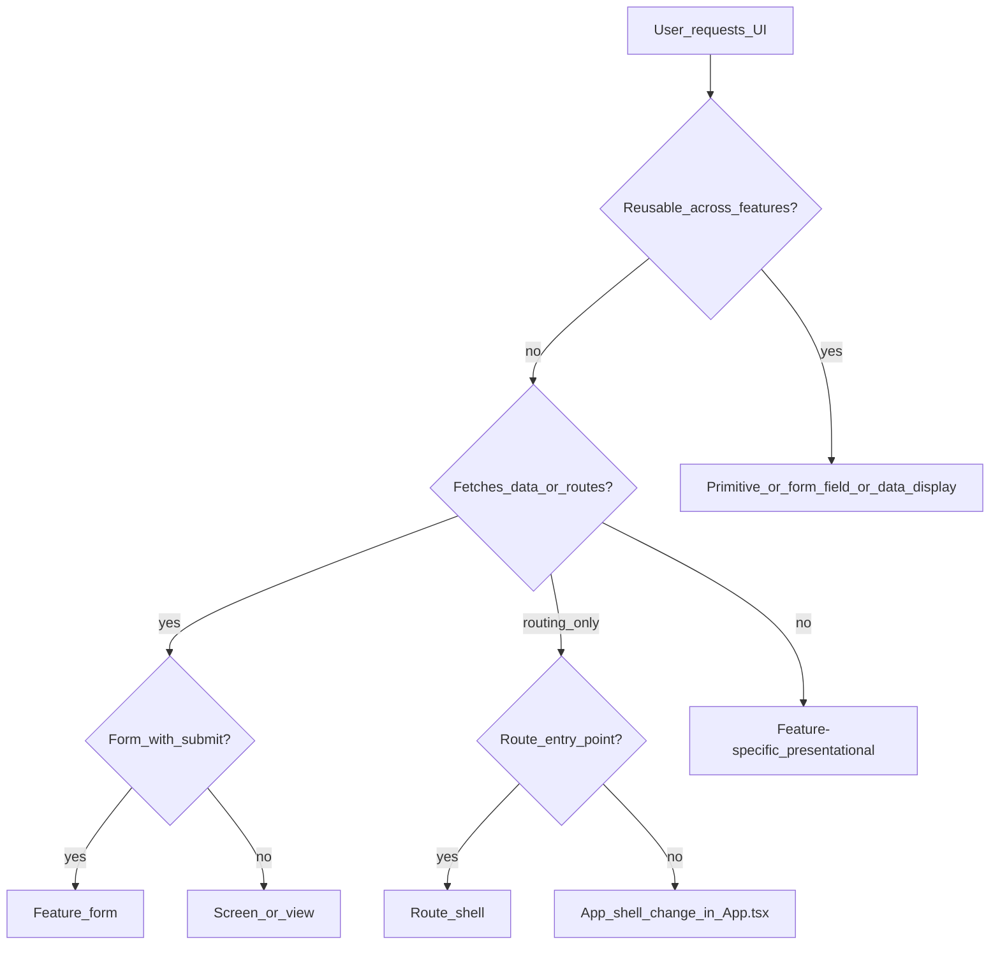
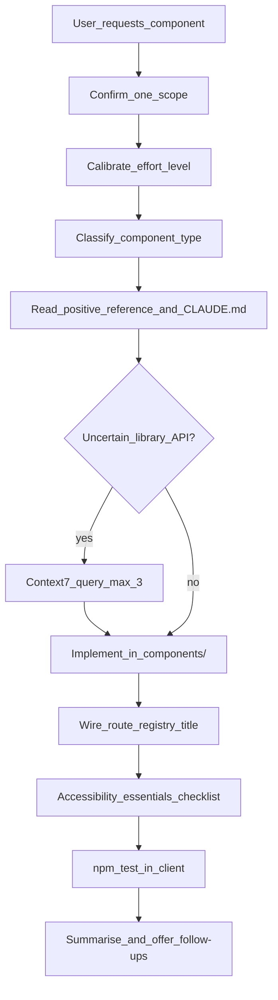

# Component Builder

Guides building hand-authored React components for the `client/` TypeScript app. Covers every UI building block type in this repo — from a single `Badge` to a full feature screen like `IncidentsView` or `AuditsView`.

## Core rules

| Rule | Detail |
|------|--------|
| **One scope per request** | Build **one** component file, **one** route shell, or **one** cohesive feature slice (e.g. a form + its validation helpers in the same file). If the user asks for multiple unrelated components, build the first and offer to continue. |
| **Read `CLAUDE.md` first** | Treat [`CLAUDE.md`](../../../CLAUDE.md) as source of truth for versions, boundaries, and conventions. |
| **Hand-authored location** | Place app components in `client/src/components/`. **Never** place hand-authored code in `client/src/components/ui/` — that directory is shadcn vendor only. |
| **Match existing patterns** | Copy structure from the positive references below before inventing new abstractions. |
| **No legacy CSS** | New components use Tailwind only. Do not add new `.css` files or global rules. (`ItemsList.css` is legacy — migrate to Tailwind when touching that file.) |
| **Synthetic data only** | No PII, patient data, or realistic-looking personal identifiers in fixtures, placeholders, or examples. |
| **Use Context7** | When uncertain about React 19, Radix, shadcn, react-router-dom, react-day-picker, or Tailwind v4 APIs, resolve and query docs before writing. |
| **Run tests** | After any behavioural change, run `npm test` from `client/` and confirm the suite passes before declaring done. |
| **Tests are separate** | Do not generate Vitest tests in the same request unless the user asks. Defer to [react-test-writer](../react-test-writer/SKILL.md) — one test per request. |
| **Accessibility is built in** | Full [essentials checklist](#accessibility-essentials) for forms and screens; spot-check primitives against [Positive references](#positive-references). For a dedicated WCAG audit or build guide, use [wcag](../wcag/SKILL.md). |
| **Review is separate** | For merge-readiness review of finished code, use [code-reviewer](../code-reviewer/SKILL.md). |

## Recommended effort level

Calibrate design and implementation depth:

| Situation | Guidance |
|-----------|----------|
| Screen/view with fetch + state machine, feature form (validation, focus-first-error, API submit), app shell/routing changes, or new DataTable + Pagination composition | **think hard** — use Plan mode if multi-file |
| New Radix field wrapper or gallery registry entry with interactive demo state | **think hard** |
| Primitive or thin route shell copying an existing [Positive references](#positive-references) file | Standard effort — match neighbour structure; essentials spot-check only |

When **think hard** applies, read the matching [Build patterns by type](#build-patterns-by-type) section and [Accessibility essentials](#accessibility-essentials) in full. For dedicated WCAG audit before/after build, use [wcag](../wcag/SKILL.md). Do not generate Vitest tests in the same request unless asked ([react-test-writer](../react-test-writer/SKILL.md)).

## Use Context7

**Claude Code:**

1. `mcp__context7__resolve-library-id` — pass library name + question
2. `mcp__context7__query-docs` — pass the resolved library ID + specific question

**Cursor (Context7 MCP plugin):**

1. `resolve-library-id` — `libraryName` + `query`
2. `query-docs` — `libraryId` + `query`

**When to use** (not on every component):

- Radix primitive APIs (`Select`, `Popover`, `Dialog`)
- shadcn/ui component props and composition (`asChild`, `Slot`)
- react-day-picker v10 (`autoFocus` vs deprecated `initialFocus`)
- react-router-dom 7 (`useParams`, `NavLink`, route ordering)
- Tailwind v4 `@theme`, `@custom-variant dark`, OKLCH tokens

**Privacy:** Never send file contents, secrets, PII, or patient data in Context7 queries — only generic pattern questions.

**Limit:** At most **three** Context7 tool calls per build if you still lack an answer after the first round.

## Tech stack

Versions aligned with [`CLAUDE.md`](../../../CLAUDE.md) and [`client/package.json`](../../../client/package.json):

| Library | Version | Build relevance |
|---------|---------|-----------------|
| React | 19.2.7 | function components, hooks, explicit return types |
| TypeScript | 6.0.3 | no `any`, no `!`, explicit function return types |
| Vite | 8.1.0 | `@/` path alias |
| Tailwind CSS | 4.3.1 | OKLCH tokens in `index.css`; `cn()` for class composition |
| shadcn/ui (Nova) | — | vendor primitives under `components/ui/` |
| radix-ui | 1.6.0 | accessible interactive widgets |
| class-variance-authority | 0.7.1 | variant styling (`Badge`) |
| lucide-react | 1.21.0 | decorative icons → `aria-hidden` |
| react-router-dom | 7.18.0 | routing, `Link`, `useParams`, `useNavigate` |
| date-fns | 4.4.0 | date formatting in display and API payloads |
| react-day-picker | 10.0.1 | `autoFocus` on Calendar (not `initialFocus`) |
| sonner | 2.0.7 | toast notifications via `toast.success` / `toast.warning` / `toast.error` / `toast.info`; mount `<Toaster />` from `@/components/ui/sonner` at app shell level |
| Vitest | 4.1.9 | run after behavioural changes |

Imports from `src/` use the `@/` alias (e.g. `@/components/Badge`, `@/lib/utils`, `@/api/incidents`).

## Project layout

```
client/
  src/
    App.tsx                     — routes, nav, skip link, usePageTitle hook
    main.tsx                    — BrowserRouter
    pageTitle.ts                — SITE_TITLE, formatPageTitle
    index.css                   — OKLCH theme tokens (@theme inline)
    api.ts                      — Items API fetch layer
    api/incidents.ts            — Incidents API fetch layer + incidentUserMessage
    api/audits.ts               — Audits API fetch layer + auditUserMessage, parseAuditId
    hooks/
      useAudits.ts              — list hook for AuditsView
      useAudit.ts               — single-audit hook for detail/edit views
    errors.ts                   — ApiClientError, toUserMessage
    componentPreviews.tsx       — gallery preview components (components only)
    componentRegistry.ts        — gallery entries for reusable primitives
    components/                 — hand-authored app components (build here)
      Badge.tsx                 — primitive: status chip
      LoadingState.tsx          — primitive: loading feedback
      EmptyState.tsx            — primitive: empty feedback
      ErrorState.tsx            — primitive: error feedback + retry
      FormField.tsx             — form: label + aria injection
      formFieldUtils.ts         — form: formFieldErrorId helper
      SelectField.tsx           — form: Radix Select wrapper
      DatePickerField.tsx       — form: Popover + Calendar
      DataTable.tsx             — data: generic sortable table
      Pagination.tsx            — data: page navigation
      IncidentPageChrome.tsx    — shell: h1 + back link (incidents)
      IncidentForm.tsx          — feature form: create/edit incident
      IncidentCreateView.tsx    — route shell: thin wrapper → IncidentForm
      IncidentEditView.tsx      — route shell: parse id → IncidentForm or error
      IncidentDetailView.tsx    — screen: fetch + display incident
      IncidentsView.tsx         — screen: list + filters + table + pagination
      AuditPageChrome.tsx       — shell: h1 + back link (audits)
      AuditForm.tsx             — feature form: create/edit audit
      AuditCreateView.tsx       — route shell → AuditForm
      AuditEditView.tsx         — route shell: parse id → AuditForm or error
      AuditDetailView.tsx       — screen: fetch + display audit
      AuditsView.tsx            — screen: list + filters + table + pagination (uses useAudits)
      auditDisplay.ts           — audit badge variants, status labels, filter options
      auditPageCopy.ts          — audit headings, subtitles, success messages
      incidentDisplay.ts        — incident display helpers
      incidentPageCopy.ts       — incident headings, copy constants (INCIDENT_CREATE_HEADING etc.)
      ItemsList.tsx             — presentational list (legacy CSS — migrate when touched)
      ComponentsView.tsx        — gallery shell
      ui/                       — shadcn vendor (ESLint-ignored; do not author here)
    lib/utils.ts                — cn() helper (vendor, ESLint-ignored)
```

## Component taxonomy

Classify every build request before writing code:



| Type | Purpose | Examples | File pattern |
|------|---------|----------|--------------|
| **Primitive** | Reusable visual/status building block | `Badge`, `LoadingState`, `EmptyState`, `ErrorState` | `components/<Name>.tsx` |
| **Form field** | Labelled input wrapper | `FormField`, `SelectField`, `DatePickerField` | `components/<Name>.tsx` + optional `formFieldUtils.ts` |
| **Data display** | Tables, pagination, lists | `DataTable`, `Pagination`, `ItemsList` | `components/<Name>.tsx` |
| **Feature form** | Multi-field form with validation + API submit | `IncidentForm`, `AuditForm` | `components/<Name>.tsx` |
| **Screen / view** | Fetches data, composes primitives, owns page layout | `IncidentsView`, `IncidentDetailView`, `AuditsView`, `AuditDetailView` | `components/<Name>.tsx` |
| **Route shell** | Thin wrapper: parse route params, delegate to form/screen | `IncidentCreateView`, `IncidentEditView`, `AuditCreateView`, `AuditEditView` | `components/<Name>.tsx` |
| **Page chrome** | Shared heading + actions for a feature area | `IncidentPageChrome`, `AuditPageChrome` | `components/<Name>.tsx` |
| **App shell** | Nav, routes, skip link, document title | `App.tsx` | `App.tsx`, `pageTitle.ts` |

**Composition rule:** Screens compose primitives and data-display components. Route shells stay thin. Feature forms own validation and submit logic. Primitives stay presentational — no `fetch`, no `useNavigate`.

## Universal build standards

Apply to **every** hand-authored component:

### TypeScript

- No `any`; no non-null assertion (`!`).
- Explicit return types on all functions: `React.ReactElement`, `JSX.Element`, or `void` / `Promise<void>` as appropriate.
- Prefer React.ReactElement for primitives, form fields, and data-display components; JSX.Element is retained across feature forms, screens, page chrome, and route shells to match existing neighbours.
- Semicolons on, single quotes, trailing commas (Prettier).
- No `console.log` or `debugger`.
- Export named components (prefer `export function X` or `export const X` — match neighbours in the same file).

### React

- Function components only; hooks at top level — no conditional hooks.
- `useEffect` / `useCallback` dependency arrays must be exhaustive.
- Prefer `useCallback` for fetch handlers referenced in `useEffect`.
- Async handlers: `async function handleSubmit(...): Promise<void>` with `event.preventDefault()` in forms.
- Invoke async effects with `void loadData()` inside `useEffect`.

### Styling

- Compose classes with `cn()` from `@/lib/utils`.
- Use theme tokens (`text-foreground`, `text-muted-foreground`, `border-border`, `bg-card`, `text-destructive`, etc.) — not hard-coded hex colours.
- Interactive elements: shadcn `Button` or match its `focus-visible:ring-*` pattern.
- Responsive layout: `flex-col` → `sm:flex-row`, `w-full sm:w-auto` on action buttons.
- Animations: add `motion-reduce:` fallbacks where spinners or motion convey status.

### Imports

```typescript
import type { JSX } from 'react';           // when returning JSX.Element
import * as React from 'react';             // when using React.ReactElement / ReactNode
import { cn } from '@/lib/utils';
import { Button } from '@/components/ui/button';
```

Vendor imports from `@/components/ui/*` only — never copy vendor source into hand-authored files.

### File naming

- PascalCase matching the primary export: `IncidentsView.tsx` → `export function IncidentsView`.
- Co-locate pure helpers in the same file (private functions) or `formFieldUtils.ts` when shared across field wrappers.

## Positive references

Match patterns already used in this repo:

| Type | Reference | Key patterns |
|------|-----------|----------------|
| Primitive (status) | [`Badge.tsx`](../../../client/src/components/Badge.tsx) | `cva` variants; icon + text (not colour alone); `aria-hidden` icon |
| Primitive (states) | [`LoadingState.tsx`](../../../client/src/components/LoadingState.tsx), [`EmptyState.tsx`](../../../client/src/components/EmptyState.tsx), [`ErrorState.tsx`](../../../client/src/components/ErrorState.tsx) | `role="status"` + `aria-live="polite"` vs `role="alert"`; shadcn `Button` for retry |
| Form field (native) | [`FormField.tsx`](../../../client/src/components/FormField.tsx) | `htmlFor`/`id`; `cloneElement` aria injection; `role="alert"` errors |
| Form field (Radix) | [`SelectField.tsx`](../../../client/src/components/SelectField.tsx), [`DatePickerField.tsx`](../../../client/src/components/DatePickerField.tsx) | `aria-*` on trigger/button, not Radix root; `autoFocus` on Calendar |
| Form utility | [`formFieldUtils.ts`](../../../client/src/components/formFieldUtils.ts) | `formFieldErrorId(htmlFor)` for consistent error ids |
| Data display | [`DataTable.tsx`](../../../client/src/components/DataTable.tsx), [`Pagination.tsx`](../../../client/src/components/Pagination.tsx) | Generic `<T>`; `role="region"` + `aria-label`; `aria-sort`; `nav` + `aria-current` |
| Feature form | [`incidentPageCopy.ts`](../../../client/src/components/incidentPageCopy.ts), [`IncidentForm.tsx`](../../../client/src/components/IncidentForm.tsx) | Copy constants in `*PageCopy.ts`; `validateX()`, field order, and focus management in `*Form.tsx`; discriminated props (`mode: 'create' \| 'edit'`) |
| Feature form (audits) | [`auditPageCopy.ts`](../../../client/src/components/auditPageCopy.ts), [`AuditForm.tsx`](../../../client/src/components/AuditForm.tsx) | Same patterns as incidents; `auditUserMessage` for errors |
| Screen | [`IncidentsView.tsx`](../../../client/src/components/IncidentsView.tsx) | State machine (initial load / refetch / error / empty / populated); overlay loading |
| Screen (audits) | [`AuditsView.tsx`](../../../client/src/components/AuditsView.tsx), [`hooks/useAudits.ts`](../../../client/src/hooks/useAudits.ts) | Centralised list hook; filters, sort, pagination |
| Detail screen | [`IncidentDetailView.tsx`](../../../client/src/components/IncidentDetailView.tsx), [`AuditDetailView.tsx`](../../../client/src/components/AuditDetailView.tsx) | `useParams` + `parseIncidentId` / `parseAuditId`; progressive title; `<dl>` for read-only fields |
| Route shell | [`IncidentCreateView.tsx`](../../../client/src/components/IncidentCreateView.tsx), [`IncidentEditView.tsx`](../../../client/src/components/IncidentEditView.tsx), [`AuditCreateView.tsx`](../../../client/src/components/AuditCreateView.tsx), [`AuditEditView.tsx`](../../../client/src/components/AuditEditView.tsx) | Thin wrapper; invalid-id guard with `ErrorState` |
| Page chrome | [`IncidentPageChrome.tsx`](../../../client/src/components/IncidentPageChrome.tsx), [`AuditPageChrome.tsx`](../../../client/src/components/AuditPageChrome.tsx) | `h1` + subtitle; `Button asChild` + `Link` |
| App shell | [`App.tsx`](../../../client/src/App.tsx) | Skip link; `aria-label="Views"` nav; `usePageTitle`; route ordering |
| Page title | [`pageTitle.ts`](../../../client/src/pageTitle.ts) | `formatPageTitle(pageTitle)` → `"Page | Radar Practice"` |
| Gallery registry | [`componentRegistry.ts`](../../../client/src/componentRegistry.ts) + [`componentPreviews.tsx`](../../../client/src/componentPreviews.tsx) | `ComponentEntry` array; preview components live in the `.tsx` file |
| API layer | [`api/incidents.ts`](../../../client/src/api/incidents.ts), [`api/audits.ts`](../../../client/src/api/audits.ts) | Typed fetch; `incidentUserMessage` / `auditUserMessage` for user-safe errors |

## Build patterns by type

### 1. Primitives (Badge, LoadingState, EmptyState, ErrorState)

**When:** A reusable visual or status block used across multiple screens.

**Structure:**

```typescript
type LoadingStateProps = {
  message?: string;
  variant?: 'block' | 'overlay';
};

export const LoadingState = ({
  message = 'Loading...',
  variant = 'block',
}: LoadingStateProps): React.ReactElement => {
  return (
    <div role="status" aria-live="polite" className={cn(/* ... */)}>
      {/* decorative spinner: aria-hidden */}
      <p className="text-sm font-medium">{message}</p>
    </div>
  );
};
```

**Rules:**

- Props drive all variation — no internal `fetch` or routing.
- Loading/empty: `role="status"` + `aria-live="polite"`.
- Errors: `role="alert"`.
- Accept optional `className` via `cn()` when the primitive may need layout adjustment.
- Export constants for user-visible copy only when reused across files (see `INCIDENT_CREATE_HEADING` in `incidentPageCopy.ts`).

**Registry:** Add a preview component to [`componentPreviews.tsx`](../../../client/src/componentPreviews.tsx) and its entry to [`componentRegistry.ts`](../../../client/src/componentRegistry.ts) when the primitive is gallery-worthy.

### 2. Form fields (FormField, SelectField, DatePickerField)

**When:** A labelled control with validation feedback, reused across forms.

**Native input pattern** — wrap with `FormField`; pass a single child element:

```typescript
<FormField label="Title" htmlFor="incident-title" error={fieldErrors.title} required>
  <input
    id="incident-title"
    type="text"
    value={title}
    onChange={(e) => setTitle(e.target.value)}
    className={inputClassNameWithError(fieldErrors.title !== undefined)}
  />
</FormField>
```

`FormField` injects `aria-describedby`, `aria-invalid`, and `aria-required` via `cloneElement` — works for native DOM children only.

**Radix select pattern** — set `aria-*` on `SelectTrigger`, not `Select.Root`:

```typescript
<FormField label={label} htmlFor={id} error={error} required={required}>
  <Select value={value} onValueChange={onValueChange}>
    <SelectTrigger
      id={id}
      aria-describedby={error ? errorId : undefined}
      aria-invalid={error ? true : undefined}
      aria-required={required || undefined}
    >
      <SelectValue placeholder={placeholder} />
    </SelectTrigger>
    <SelectContent>{/* SelectItem options */}</SelectContent>
  </Select>
</FormField>
```

**Date picker pattern** — `PopoverTrigger asChild` + `Button` with `id`; `Calendar` with `autoFocus`:

```typescript
<Calendar mode="single" selected={value} onSelect={onChange} autoFocus />
```

**Rules:**

- Always pair `label` + `id` + `htmlFor`.
- Error element id from `formFieldErrorId(id)` in [`formFieldUtils.ts`](../../../client/src/components/formFieldUtils.ts).
- Error copy: short, specific (`'Title is required.'`).
- Required indicator: decorative `*` with `aria-hidden="true"` on the asterisk (see `FormField`).

### 3. Data display (DataTable, Pagination, ItemsList)

**When:** Tabular or list data with optional sorting, paging, or status props.

**DataTable** — generic row type required:

```typescript
type IncidentRow = Incident & Record<string, unknown>;

<DataTable<IncidentRow>
  ariaLabel="Incidents list, scrollable"
  columns={columns}
  data={tableData}
  sortKey={sortKey}
  sortDirection={sortDirection}
  onSort={handleSort}
/>
```

- Column `render` for links, badges, formatted dates.
- At least one sortable column or interactive cell so keyboard users can reach overflowing content.
- Empty table body: `emptyState` prop or default copy.

**Pagination** — controlled component; caller owns page state:

```typescript
<Pagination
  currentPage={page}
  totalPages={result.totalPages}
  onPageChange={setPage}
/>
```

**Presentational list** — accept a `status` union and render loading/error/empty/ready (see `ItemsListStatus` in `ItemsList.tsx`). New lists should use Tailwind and shared primitives (`LoadingState`, `ErrorState`, `EmptyState`) instead of bespoke CSS.

### 4. Feature forms (IncidentForm, AuditForm)

**When:** Multi-field create/edit flow with client validation and API submit.

**Structure:**

1. **Discriminated props** for mode variants: `{ mode: 'create' } | { mode: 'edit'; incidentId: number }` (or `auditId` for audits).
2. **Pure validation function** returning a field-error map: `validateIncidentForm(values): FieldErrors`.
3. **Field order array** aligned with validation — used for focus-first-error.
4. **Stable element ids** map for `document.getElementById` focus management.
5. **Load state** (edit mode): separate `loadLoading` / `loadError` from submit state.
6. **Submit handler**: validate → focus first error → API call → navigate or show `submitError`.
7. **Page chrome**: `IncidentPageChrome` with exported heading constants.
8. **User-safe errors**: `incidentUserMessage(err, 'loading' | 'creating' | 'updating')` or `auditUserMessage(err, ...)` from API layer — never expose stack traces.

**Focus-first-error pattern** (from `IncidentForm.tsx` / `AuditForm.tsx`):

```typescript
const shouldFocusFirstErrorRef = useRef(false);

// In submit handler when validation fails:
shouldFocusFirstErrorRef.current = true;
setFieldErrors(errors);

useLayoutEffect(() => {
  if (!shouldFocusFirstErrorRef.current) return;
  shouldFocusFirstErrorRef.current = false;
  const firstKey = getFirstInvalidFieldKey(fieldErrors);
  if (firstKey === undefined) return;
  const element = document.getElementById(FIELD_ELEMENT_IDS[firstKey]);
  if (element instanceof HTMLElement) {
    element.focus();
    element.scrollIntoView({ block: 'nearest' });
  }
}, [fieldErrors]);
```

**Rules:**

- `type="submit"` on primary button; `disabled={submitting}` during API call.
- Preserve field values on submit failure; clear only on success.
- Use `useNavigate()` for post-create redirect.

### 5. Screens / views (IncidentsView, IncidentDetailView, AuditsView, AuditDetailView)

**When:** A route renders a full page that fetches data and composes primitives.

**Audits list screens** should use [`useAudits`](../../../client/src/hooks/useAudits.ts) for fetch/filter/sort/pagination state — do not duplicate that logic inline (IncidentsView still uses inline `useState`/`useEffect`; new modules follow the hooks pattern).

**Screen layout:**

```tsx
<>
  {/* Page header: h1 + subtitle + primary action */}
  <div className="flex flex-col gap-4 sm:flex-row sm:items-start sm:justify-between">
    <div>
      <h1>Incidents</h1>
      <p className="mt-1 text-sm text-muted-foreground">...</p>
    </div>
    <Button asChild className="w-full sm:w-auto">
      <Link to="/incidents/create">Create incident</Link>
    </Button>
  </div>

  {/* Content card */}
  <section className="rounded-lg border border-border bg-card p-6">
    {/* filters, state machine, table */}
  </section>
</>
```

**State machine** — implement explicit phases:

| Phase | Condition | Render |
|-------|-----------|--------|
| Initial load | `loading && data === null && error === null` | `<LoadingState />` |
| Fatal error | `error && data === null` | `<ErrorState onTryAgain={...} />` |
| Empty | `!loading && data empty` (respect filters) | `<EmptyState />` |
| Populated | has data | table/list + optional `<Pagination />` |
| Refetch | `loading && data !== null` | keep table mounted; `<LoadingState variant="overlay" />`; `aria-busy` on wrapper |

**Rules:**

- `useCallback` for fetch functions; `useEffect` depends on fetch + filter state.
- Reset page to 1 when filters or sort change.
- Map API enums to display labels and `Badge` variants in private helper functions.
- Read-only detail: semantic `<dl>` / `<dt>` / `<dd>` (see `IncidentDetailView`).
- Links in tables: `Link` with underline — purpose clear from link text alone.
- Optional: refine `document.title` after data loads (see `IncidentDetailView` + `formatPageTitle`).

### 6. Route shells (IncidentCreateView, IncidentEditView)

**When:** `App.tsx` needs a route entry that delegates to a form or screen.

Keep the file **thin**:

```typescript
export function IncidentEditView(): JSX.Element {
  const { id } = useParams();
  const incidentId = parseIncidentId(id);

  if (incidentId === null) {
    return (
      <>
        <IncidentPageChrome heading={INCIDENT_EDIT_HEADING} />
        <ErrorState title="Invalid incident" message="The incident ID in the URL is not valid." />
      </>
    );
  }

  return <IncidentForm mode="edit" incidentId={incidentId} />;
}
```

**Rules:**

- Parse and validate route params with shared helpers (`parseIncidentId` from `@/api/incidents`).
- Invalid params: show `IncidentPageChrome` + `ErrorState` — do not throw.
- Create views can be a one-line re-export of the form with `mode="create"`.

### 7. App shell changes (App.tsx, pageTitle.ts)

**When:** Adding a route, nav link, or document title.

**Checklist:**

1. Add `Route` in `App.tsx` — **specific routes before parametric ones**:
   - `/incidents/create` before `/incidents/:id`
   - `/audits/create` before `/audits/:id`
2. Add `NavLink` if the view is top-level navigation.
3. Add a matchPath branch in resolvePageTitle (in App.tsx) if the page needs a specific document.title.
4. Export heading constants from the feature form/screen if `App.tsx` needs them for titles.
5. Preserve skip link (`href="#main-content"`) and `id="main-content"` landmark.
6. Nav uses `aria-label="Views"`.

## API integration

Hand-authored components call typed modules — never inline `fetch` in primitives.

| API | Module | User messages |
|-----|--------|---------------|
| Items | [`api.ts`](../../../client/src/api.ts) | `toUserMessage(err, 'load' \| 'create')` from [`errors.ts`](../../../client/src/errors.ts) |
| Incidents | [`api/incidents.ts`](../../../client/src/api/incidents.ts) | `incidentUserMessage(err, 'loading' \| 'creating' \| 'updating' \| 'deleting')` |
| Audits | [`api/audits.ts`](../../../client/src/api/audits.ts) | `auditUserMessage(err, 'loading' \| 'creating' \| 'updating' \| 'deleting')` |

**Rules:**

- Catch errors in the screen/form — map to user-visible strings via helpers above.
- Never display stack traces, HTTP status codes, or raw JSON errors to users.
- Loading/submitting flags prevent duplicate submissions.

## Accessibility essentials

Build accessibly by default. For WCAG 2.2 AA audit reports or detailed build guides, use [wcag](../wcag/SKILL.md). For Vitest accessibility assertions after building, use [react-test-writer §6](../react-test-writer/SKILL.md#6-accessibility-tests).

For forms and screens, work through the checklist below in full; for primitives, spot-check against [Positive references](#positive-references).

**Minimum checklist for every new component:**

- [ ] One `h1` per screen/view; logical heading order
- [ ] Visible labels on all form controls (`htmlFor`/`id` or Radix trigger `id`)
- [ ] Error text in `role="alert"`; `aria-invalid` on the focusable control
- [ ] Loading/empty: `role="status"` + `aria-live="polite"`; errors: `role="alert"`
- [ ] Decorative icons: `aria-hidden="true"`
- [ ] Status not conveyed by colour alone (pair `Badge` variant with icon + text)
- [ ] Interactive elements are `<button>` or shadcn `Button` — not `div onClick`
- [ ] Focus visible: `focus-visible:ring-*` on custom buttons; shadcn Button for actions
- [ ] Radix: `aria-*` on DOM nodes (`SelectTrigger`, `Button`), not headless roots
- [ ] Calendar: `autoFocus` (react-day-picker v10)
- [ ] Target size ≥ 24×24 CSS px for compact controls
- [ ] `motion-reduce:` on spinners/animations

## shadcn / Radix gotchas

Brief pointers — full testing and audit coverage in [react-test-writer](../react-test-writer/SKILL.md) and [wcag](../wcag/SKILL.md).

| Gotcha | Fix |
|--------|-----|
| `Select.Root` renders no DOM | Put `id` and `aria-*` on `SelectTrigger` |
| `FormField` `cloneElement` | Only injects aria onto a single native child; Radix fields set aria on trigger manually |
| `initialFocus` on Calendar | **Silently ignored** in react-day-picker v10 — use `autoFocus` |
| `DataTable` generic | Always pass explicit `<T extends Record<string, unknown>>` |
| Vendor `ui/` files | ESLint-ignored — do not hand-edit; add shadcn components via CLI when needed |
| Portals (Select, Popover) | Expect content outside the trigger subtree; app code owns labels and trigger aria |

## Component gallery (componentRegistry)

When adding a **reusable primitive or field wrapper**, register it for the `/components` gallery:

1. Add and export a `*Preview` function component in [`componentPreviews.tsx`](../../../client/src/componentPreviews.tsx) with local state for interactive demos. That module must export **components only** — no types, constants, or helpers, or the `react-refresh/only-export-components` rule fires.
2. Import it in [`componentRegistry.ts`](../../../client/src/componentRegistry.ts) and append a `ComponentEntry` to the `componentRegistry` array: `{ name, description, preview: FooPreview }` where `preview` is a `ComponentType` reference (not pre-instantiated JSX).

Screens and route shells are **not** registered unless explicitly requested.

## Wiring new routes

When a new screen or shell needs routing:

1. Create the component in `client/src/components/`.
2. Import and add `<Route>` in [`App.tsx`](../../../client/src/App.tsx).
3. Add a matchPath branch in resolvePageTitle (in App.tsx) if the page needs a specific document.title.
4. Optionally add `NavLink` for top-level discovery.
5. Run `npm test` — add tests via [react-test-writer](../react-test-writer/SKILL.md) when asked.

## Workflow for each build request

1. **Confirm scope** — one component, screen, or feature slice; clarify create vs edit vs read-only if ambiguous. For screens or feature forms spanning multiple files, use Plan mode before implementing.
2. **Calibrate effort** — apply [Recommended effort level](#recommended-effort-level); use Plan mode when **think hard** spans multiple files.
3. **Classify** — use the [taxonomy](#component-taxonomy) to pick the component type.
4. **Skim `CLAUDE.md`** if not already in context.
5. **Read the positive reference** for that type (table above) — match its structure before writing.
6. **Context7** — if uncertain about Radix, shadcn, or router APIs (max three calls).
7. **Implement** — single file (or tight feature slice); universal standards + type-specific patterns.
8. **Wire** — route, registry, or `pageTitle` updates if the feature is user-facing.
9. **Accessibility pass** — full [essentials checklist](#accessibility-essentials) for forms/screens; spot-check primitives; defer deep audit to [wcag](../wcag/SKILL.md).
10. **Run `npm test`** from `client/`, fix regressions, and confirm the suite passes before declaring done.
11. **Summarise** what was built, which files changed, and test result.
12. **Offer follow-ups** — test (react-test-writer), journey tests (playwright-test-writer), WCAG audit (wcag), or code review (code-reviewer).

### Build flow



## Related skills

| Skill | When to use |
|-------|-------------|
| [wcag](../wcag/SKILL.md) | Dedicated WCAG 2.2 AA audit or accessibility build guide (report only) |
| [react-test-writer](../react-test-writer/SKILL.md) | Vitest tests after building — one test per request |
| [playwright-test-writer](../playwright-test-writer/SKILL.md) | Browser journey tests |
| [code-reviewer](../code-reviewer/SKILL.md) | Full-stack or frontend review of finished code (advisory only) |

**Typical sequence:** **component-builder** → **react-test-writer** (tests) → **playwright-test-writer** (journeys) → **wcag** (audit) → **code-reviewer** (merge readiness).
