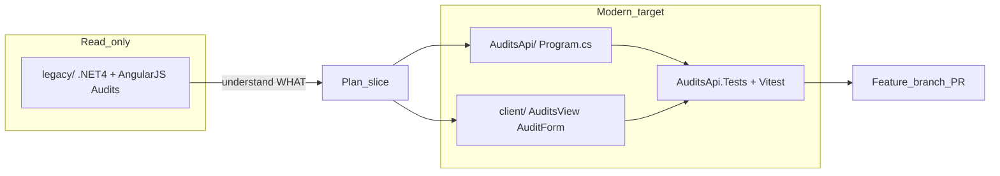
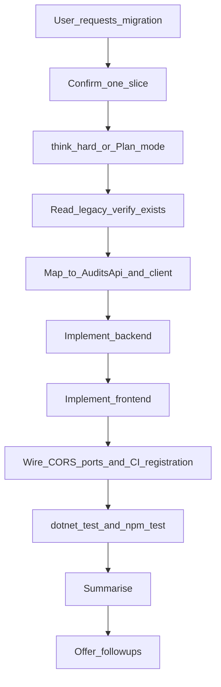

# Modernisation

Guides agents porting **behaviour and domain** from `legacy/` (.NET 4 / AngularJS) into the modern stack already established in this repo (.NET 8 minimal APIs + React 19). Legacy answers *what* to build; [IncidentsApi](../../../IncidentsApi/) and the Incidents client module answer *how*.

## Core rules

| Rule | Detail |
|------|--------|
| **Read `CLAUDE.md` first** | Treat [`CLAUDE.md`](../../../CLAUDE.md) as source of truth for versions, boundaries, and conventions |
| **Read legacy first** | Inspect `legacy/` to extract routes, fields, validation rules, API contracts, and user-visible copy — before writing modern code |
| **Never edit `legacy/`** | Permanent before-state evidence; no fixes, refactors, or formatting in that tree |
| **Rewrite, don't translate** | No AngularJS idioms in React; no Web API controllers pasted into minimal API shape without redesign |
| **One slice per request** | One API project slice, one screen, one form, or one route+wiring — not full-stack mega-diffs unless the user explicitly asks |
| **Match Incidents shape** | New domains (e.g. Audits) follow IncidentsApi + Incidents module conventions — see [Positive references](#positive-references) |
| **Plan mode for non-trivial slices** | Multi-file backend + frontend → plan before implement (per project workflow) |
| **Tests after migration** | `dotnet test` for API changes; `npm test` from `client/` for UI — defer test *authorship* to [dotnet-test-writer](../dotnet-test-writer/SKILL.md) / [react-test-writer](../react-test-writer/SKILL.md) unless the user asks in the same turn |
| **Confirm suite passes before declaring done** | After `dotnet test` and `npm test`, confirm the full suite passes before declaring done |
| **PR captures transformation** | Feature branch + PR; the diff is part of the deliverable narrative |
| **Synthetic data only** | No PII, patient data, or realistic-looking personal identifiers in migrated fixtures |
| **Use Context7** | For ASP.NET Core minimal API, EF Core, React 19, or react-router-dom when API details are uncertain |

## Recommended effort level

Migration is complex reasoning work, not pattern following. Default to **think hard** for every request:

| Situation | Guidance |
|-----------|----------|
| Any legacy → modern port (API, UI, or both) | **think hard** — map domain intent; do not mirror legacy structure |
| Full vertical slice (new API + list + create + detail + edit) | **think hard** + Plan mode before touching files |
| Extending an already-migrated module with one new endpoint or field | **think hard** — still verify legacy behaviour first |

There is no "standard effort" row for this skill — treat all migration work as high-complexity.

## Migration philosophy

Legacy code under `legacy/` is a reference for **what** to build, not **how** to build it ([`CLAUDE.md`](../../../CLAUDE.md), [code-reviewer](../code-reviewer/SKILL.md)).

**Legacy answers:**

- What does the user see?
- What data fields exist?
- What validation rules apply?
- What API operations are required?

**Modern answers:**

- How does [IncidentsApi](../../../IncidentsApi/) already structure a standalone API?
- How does the Incidents client module already compose screens, forms, and routing?

**Anti-patterns to reject:**

- `$scope` variables copied as React state object shapes
- `ng-controller` names reused as component names
- Angular service singletons ported as global modules
- `HttpResponseMessage` wrappers kept verbatim instead of `Results.*`
- Digest-cycle or two-way-binding thinking in React

## Tech stack (modern target)

Versions aligned with [`CLAUDE.md`](../../../CLAUDE.md):

| Area | Versions |
|------|----------|
| Backend | .NET 8.0, EF Core 8.0.27, SQLite, minimal API, repository pattern |
| Backend tests | xUnit 2.5.3, NSubstitute 5.1.0, `TestWebApplicationFactory` |
| Frontend | React 19.2.7, TypeScript 6.0.3, Vite 8.1.0, react-router-dom 7.18.0 |
| Frontend UI | Tailwind CSS 4.3.1, shadcn/ui (Nova), shared components in `client/src/components/` |
| Frontend tests | Vitest 4.1.9 — run `npm test` from `client/` |

## Project layout

> **Note:** `legacy/` is created per-migration and may not exist in the repo yet. Before reading legacy code, verify the folder exists. If it is absent, ask the user for the source location before proceeding.

### Read-only legacy (before-state)

```
legacy/
  Audits/                     — .NET 4 Web API (or similar)
  Audits.Web/ or client/      — AngularJS views, controllers, services
```

Paths may vary — locate controllers, services, and templates under `legacy/` for the named feature. **Never modify this tree.**

### Modern target (write here)

New domains mirror the Incidents split. Example taxonomy for an **Audits** vertical slice:

```
AuditsApi/
  Program.cs                  — minimal API endpoints; CORS; DI; Database.Migrate()
  IAuditRepository.cs         — repository interface
  Audit.cs, AuditRequest.cs   — models / DTOs
  AuditListQuery.cs           — filter/sort/paginate query (if list is paged)
  PagedAuditsResult.cs        — paged list result (if applicable)
  Data/AuditsDbContext.cs     — dedicated DbContext (audits.db)
  Repositories/EfAuditRepository.cs
  Migrations/

AuditsApi.Tests/
  TestWebApplicationFactory.cs
  GetAuditsTests.cs, PostAuditsTests.cs, ...

client/src/
  api/audits.ts               — typed fetch layer + user-safe error helpers
  components/
    auditDisplay.ts           — badge variants, labels, filter options (if needed)
    AuditsView.tsx              — list + filters + DataTable + Pagination
    AuditForm.tsx               — create/edit validation + submit
    AuditCreateView.tsx         — thin route shell
    AuditDetailView.tsx         — read-only detail
    AuditEditView.tsx           — thin route shell + id parse
    AuditPageChrome.tsx         — shared h1 + back link
  App.tsx                     — new routes + NavLink (specific routes before parametric)
```

Existing reference implementation (copy patterns, not file names blindly):

```
IncidentsApi/                 — standalone API, incidents.db
client/src/api/incidents.ts
client/src/components/IncidentsView.tsx, IncidentForm.tsx, ...
```

### Migration flow



## .NET 4 → .NET 8 patterns

| Legacy (.NET 4) | Modern (.NET 8 in this repo) |
|-----------------|------------------------------|
| `Global.asax` / `Application_Start` | Top-level `Program.cs`: `WebApplication.CreateBuilder`, DI, `app.Map*` — see [IncidentsApi/Program.cs](../../../IncidentsApi/Program.cs) |
| `Web.config` (`connectionStrings`, `appSettings`) | `appsettings.json` + `builder.Configuration` for logging and host config only; SQLite DB path follows Incidents precedent — hardcoded in `Program.cs` (`DataSource=audits.db`), not in `appsettings.json` |
| `System.Web` / `HttpContext` | `Microsoft.AspNetCore.*`; minimal API delegates |
| Web API controllers + `HttpResponseMessage` | `Results.Ok` / `Results.Created` / `Results.BadRequest` / `Results.NotFound` |
| EF6 / ADO in controllers | Dedicated `DbContext` in `Data/`, `Ef*Repository` implementing `I*Repository`, **scoped** DI |
| Shared monolith database | Standalone API project per domain (ItemsApi vs IncidentsApi vs AuditsApi) |
| Per-action exception filters | Global `UseExceptionHandler` only — **no** per-endpoint try/catch |

### Backend reuse checklist

| Concern | Copy from |
|---------|-----------|
| Minimal API + CORS + migrate on startup | [IncidentsApi/Program.cs](../../../IncidentsApi/Program.cs) |
| DbContext + enum storage | [IncidentsApi/Data/IncidentsDbContext.cs](../../../IncidentsApi/Data/IncidentsDbContext.cs) |
| Repository reads/writes | [IncidentsApi/Repositories/EfIncidentRepository.cs](../../../IncidentsApi/Repositories/EfIncidentRepository.cs) — `AsNoTracking()` for reads |
| In-memory test factory | [IncidentsApi.Tests/TestWebApplicationFactory.cs](../../../IncidentsApi.Tests/TestWebApplicationFactory.cs) |
| Integration tests | [dotnet-test-writer](../dotnet-test-writer/SKILL.md) — one `[Fact]` per request |

**Rules:**

- Endpoints depend on `IAuditRepository` (or equivalent interface), never on `DbContext` or concrete repository directly.
- Schema changes require a new EF Core migration under the new API project.
- Global exception handler returns `{ error: "..." }` — never expose stack traces to the client.
- Enums stored as `int` in SQLite when sort order matters; `JsonStringEnumConverter` for JSON over the wire (Incidents precedent).

## AngularJS → React 19 patterns

| Legacy (AngularJS) | Modern (React 19 in this repo) |
|--------------------|--------------------------------|
| Controller + `$scope` | Function component + `useState` / `useReducer` |
| `ng-repeat` | `array.map()` with stable `key` |
| `ng-model` | Controlled input: `value` + `onChange` |
| `ng-if` / `ng-show` | Conditional rendering (`&&` or ternary) |
| `$http` / `$resource` | Typed module under `client/src/api/` (`fetch` + guards); screen owns loading/error state |
| Angular services | `useCallback` fetch handlers in screens/forms, or pure utilities (e.g. `auditDisplay.ts`) |
| `ui-router` states | react-router-dom 7: `Route`, `Link`, `useParams`, `useNavigate` in [App.tsx](../../../client/src/App.tsx) |
| Directives / `$compile` | Composable components — [FormField](../../../client/src/components/FormField.tsx), [DataTable](../../../client/src/components/DataTable.tsx) |

### Idiomatic React requirements

- No `$scope`-style god objects; split route shells, screens, and forms like the Incidents module.
- Route shells stay thin — [IncidentCreateView](../../../client/src/components/IncidentCreateView.tsx), [IncidentEditView](../../../client/src/components/IncidentEditView.tsx) → `AuditCreateView`, `AuditEditView`.
- Screens implement an explicit state machine: loading / error / empty / populated — [IncidentsView](../../../client/src/components/IncidentsView.tsx) → `AuditsView`.
- Feature forms own validation and submit — [IncidentForm.tsx](../../../client/src/components/IncidentForm.tsx) → `AuditForm`.
- API errors via dedicated helpers (`incidentUserMessage` pattern in [api/incidents.ts](../../../client/src/api/incidents.ts)) — never stack traces or raw HTTP bodies in UI.
- Hand-authored components in `client/src/components/` only — never in `components/ui/`.
- Tailwind + shadcn only — no new legacy `.css` files.

**Produce idiomatic React.** If the migrated code still "looks like AngularJS in JSX", stop and redesign using hooks and composition.

## Positive references

Match patterns already used for Incidents when building Audits (or any new migrated domain):

| Concern | Reference |
|---------|-----------|
| Standalone API + DbContext | [IncidentsApi/](../../../IncidentsApi/) layout |
| Paged list endpoint | `GET /incidents` in [IncidentsApi/Program.cs](../../../IncidentsApi/Program.cs) |
| List screen + filters + table + pagination | [IncidentsView.tsx](../../../client/src/components/IncidentsView.tsx) → `AuditsView` |
| Create/edit form + validation | [IncidentForm.tsx](../../../client/src/components/IncidentForm.tsx) → `AuditForm` |
| Detail read-only view | [IncidentDetailView.tsx](../../../client/src/components/IncidentDetailView.tsx) → `AuditDetailView` |
| Route shells | [IncidentCreateView.tsx](../../../client/src/components/IncidentCreateView.tsx), [IncidentEditView.tsx](../../../client/src/components/IncidentEditView.tsx) |
| Page chrome | [IncidentPageChrome.tsx](../../../client/src/components/IncidentPageChrome.tsx) → `AuditPageChrome` |
| Display helpers | [incidentDisplay.ts](../../../client/src/components/incidentDisplay.ts) → `auditDisplay.ts` |
| Typed fetch layer | [api/incidents.ts](../../../client/src/api/incidents.ts) → `api/audits.ts` |
| Shared UI primitives | `Badge`, `LoadingState`, `EmptyState`, `ErrorState`, `FormField`, `SelectField`, `DatePickerField`, `DataTable`, `Pagination` |
| Routing + nav + page title | [App.tsx](../../../client/src/App.tsx), [pageTitle.ts](../../../client/src/pageTitle.ts) |
| Page copy constants | [incidentPageCopy.ts](../../../client/src/components/incidentPageCopy.ts) → `auditPageCopy.ts` |
| Runtime guards + response parsing | [guards.ts](../../../client/src/guards.ts) — use runtime guards, not bare `as` casts |
| API env var pattern | `import.meta.env.VITE_INCIDENTS_API_URL` in [api/incidents.ts](../../../client/src/api/incidents.ts) → `VITE_AUDITS_API_URL` |
| PUT and GET by id endpoints | `PUT /incidents/:id`, `GET /incidents/:id` in [IncidentsApi/Program.cs](../../../IncidentsApi/Program.cs) — detail and edit views depend on these |
| Success toasts | `toast.success` via Sonner in [IncidentForm.tsx](../../../client/src/components/IncidentForm.tsx) → `AuditForm` |

The **Audits** module is the **completed** reference vertical slice (Week 5): CRUD with table and pagination, reusing the shared component library and repository pattern — same shape as Incidents, different domain. Use the shipped [`AuditsApi/`](../../../AuditsApi/) and client audits module as the primary template for future legacy migrations.

## Agent guardrails

1. **Read legacy first** — summarise behaviour (routes, fields, validation, API verbs, copy) before writing modern code.
2. **Never modify `legacy/`** — it is permanent before-state evidence for interview walkthrough and PR diffs.
3. **Never copy AngularJS structure into React** — no "controller" components, no digest-cycle thinking, no service-shaped globals.
4. **Never add per-endpoint try/catch** on the backend — use the global exception handler.
5. **Never expose stack traces or raw errors** to the client.
6. **Place hand-authored UI in `client/src/components/`** — not `components/ui/`.
7. **Run tests before declaring done** — `dotnet test AuditsApi.Tests/AuditsApi.Tests.csproj` (or the relevant `.Tests` project); `npm test` from `client/`.
8. **Raise migration as a PR** — work on a feature branch so the diff captures the transformation; do not commit or `gh pr create` unless the user asks.
9. **One test per follow-up request** — project convention; use [dotnet-test-writer](../dotnet-test-writer/SKILL.md) and [react-test-writer](../react-test-writer/SKILL.md).
10. **Apply code-reviewer conventions to all new files** — no `any`, explicit return types, no non-null assertion (`!`), no `console.log` in TypeScript; repository pattern with no per-endpoint try/catch in C#.
11. **No secrets in migrated config** — never port connection strings or credentials from Web.config into appsettings.json or committed files; use environment variables.
12. **Accessibility built-in** — all migrated screens and forms must meet WCAG 2.2 AA; cross-ref [wcag](../wcag/SKILL.md) and [component-builder](../component-builder/SKILL.md) essentials. Do not defer accessibility to a separate pass unless the user asks.
13. **App shell and page title** — new Audits routes must preserve the skip link and `aria-label="Views"` nav in [App.tsx](../../../client/src/App.tsx); add a `resolvePageTitle` branch in [pageTitle.ts](../../../client/src/pageTitle.ts) for every new route.

## Use Context7

**Use Context7 when:**

- Uncertain about ASP.NET Core minimal API endpoint signatures or middleware order
- Uncertain about EF Core migration commands or DbContext configuration
- Uncertain about React 19 hook behaviour or react-router-dom 7 APIs

**Skip Context7 when:**

- The answer is already in a positive reference file in this repo — check those first
- The question is about project conventions — read CLAUDE.md instead

**Claude Code:**

1. `mcp__context7__resolve-library-id` — library name + question
2. `mcp__context7__query-docs` — resolved ID + specific question

**Cursor (Context7 MCP plugin):**

1. `resolve-library-id` — `libraryName` + `query`
2. `query-docs` — `libraryId` + `query`

**Privacy:** Never send file contents, secrets, PII, or patient data in Context7 queries — only generic pattern questions.

**Limit:** At most **three** Context7 tool calls per migration request if the first round does not answer the question.

## Common gotchas

| Gotcha | Guidance |
|--------|----------|
| Translating `ng-controller` 1:1 | Decompose into screen + form + route shell |
| Keeping Web API controller class names | Use minimal API `MapGet`/`MapPost` with repository injection |
| Shared `AppDbContext` for new domain | Separate API per domain — IncidentsApi precedent, not ItemsApi `AppDbContext` |
| `$http` promise chains | `async/await` in `useCallback`; explicit loading/error state on screens |
| Legacy CSS / Bootstrap in Angular templates | Tailwind + shadcn only |
| Editing legacy to "fix" build | Forbidden — fix the modern side only |
| Mechanical line-by-line port | Stop; re-read legacy for behaviour, then implement using Incidents patterns |

## Workflow for each migration request

1. **Confirm slice** — which legacy feature (e.g. Audits list, create form); backend-only vs frontend-only vs full slice.
2. **Calibrate effort** — always **think hard**; use Plan mode if the slice spans multiple files.
3. **Read legacy** — controllers, services, views, routes under `legacy/`; extract fields, validation, API verbs, user-visible copy.
4. **Map to modern layout** — name API project (`AuditsApi/`), entities, routes, components (Incidents parallel).
5. **Implement backend** — `AuditsDbContext`, `EfAuditRepository`, `Program.cs` endpoints, EF migration.
6. **Implement frontend** — `api/audits.ts`, `AuditsView`, `AuditForm`, route shells; wire [App.tsx](../../../client/src/App.tsx). Defer component detail to [component-builder](../component-builder/SKILL.md).
7. **Wire and verify** — CORS, port, Vite proxy if needed (Incidents uses `http://localhost:5134` with CORS; Items uses Vite proxy to 5133; Audits uses `http://localhost:5135` with CORS). `AuditsApi.Tests` is already registered in [`.github/workflows/ci.yml`](../../../.github/workflows/ci.yml). Use port 5135 in `launchSettings.json` (Items=5133, Incidents=5134, Audits=5135) — confirm no collision before running.
8. **Test** — run `dotnet test` and `npm test`; add tests via sibling skills when asked.
9. **Summarise** — behaviour preserved vs intentionally changed; files touched; remind user the PR diff is the transformation record.
10. **Offer follow-ups** — after summarising, prompt the user with next steps: test authoring via [dotnet-test-writer](../dotnet-test-writer/SKILL.md) and [react-test-writer](../react-test-writer/SKILL.md), accessibility audit via [wcag](../wcag/SKILL.md), and pre-PR advisory review via [code-reviewer](../code-reviewer/SKILL.md).



## Related skills

| Skill | When during migration |
|-------|----------------------|
| [component-builder](../component-builder/SKILL.md) | Building React screens and forms after behaviour is understood |
| [dotnet-test-writer](../dotnet-test-writer/SKILL.md) | API integration tests — one `[Fact]` per request |
| [react-test-writer](../react-test-writer/SKILL.md) | Vitest for migrated UI — one `it` per request |
| [playwright-test-writer](../playwright-test-writer/SKILL.md) | Browser journey tests after the slice is complete |
| [wcag](../wcag/SKILL.md) | Accessibility audit on new screens |
| [code-reviewer](../code-reviewer/SKILL.md) | Pre-PR advisory review |

**Typical sequence:** **modernisation** → **component-builder** (UI) → **dotnet-test-writer** + **react-test-writer** → **code-reviewer** → PR.
