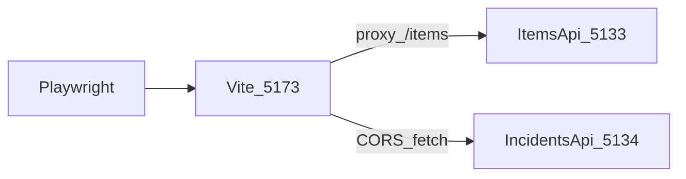

# Playwright Test Writer

Guides writing Playwright end-to-end tests for the `client/` React TypeScript app.

## Core rules

- **One test per request.** Write one `test(...)` method per request; offer the next test separately.
- **Run `npx playwright test`** from `client/` after adding or changing a test.
- **Start APIs when the journey needs data.** Playwright's `webServer` starts Vite only — ItemsApi and IncidentsApi must be running separately for journey tests (see [Run tests](#run-tests) and [Playwright gotchas](#playwright-gotchas)).
- **Use Context7** when you need to verify Playwright locator, `expect`, or `webServer` API details:
  1. `mcp__context7__resolve-library-id` with library name + question
  2. `mcp__context7__query-docs` with the resolved ID
- **Test behaviour, not implementation.** Assert what the user sees and can do — not React internals or network call counts unless the scenario explicitly requires it.
- **TypeScript conventions:** no `any`, explicit return types on every test callback and page object method, single quotes, semicolons, trailing commas. No `console.log` or `debugger`.
- **Synthetic data only** — no PII, patient data, or realistic-looking personal identifiers in fixtures (e.g. `E2E Widget`, `E2E spill in corridor B`).
- **Do not remove or edit existing tests** without explicit instruction.
- **Do not change `playwright.config.ts`** unless the user explicitly requests CI or `webServer` work.

## Recommended effort level

Calibrate reasoning depth and runtime setup:

| Situation | Guidance |
|-----------|----------|
| Journey test (items/incidents CRUD), new page object, Radix Select/DatePicker interaction, or API-dependent assertions | **think hard** — confirm ItemsApi and/or IncidentsApi are running |
| First spec in a new `*.journey.spec.ts` or shared locators across routes | **think hard** |
| Smoke test (title, nav shell, route loads) following [app.spec.ts](../../../client/e2e/app.spec.ts) | Standard effort — Vite via `webServer` only; no extra keyword |

When **think hard** applies, classify smoke vs journey before writing; do not require APIs for smoke. Prefer accessible locators from [react-test-writer §6](../react-test-writer/SKILL.md#6-accessibility-tests). Do not expand Week 5 journey catalog beyond the single `test` requested.

## Tech stack

| Library | Version |
|---------|---------|
| @playwright/test | 1.60.0 |
| Node.js | 24 (LTS) |
| Vite dev server | 8.0.12 (port 5173) |
| React | 19.2.6 |
| TypeScript | 6.0.2 |
| react-router-dom | 7.16.0 |

Run tests with `npx playwright test` from the `client/` directory.

There is no `test:e2e` npm script in `package.json` yet — use `npx playwright test` directly. A future repo change may add `"test:e2e": "playwright test"`.

**Browser:** Chromium only. Install once per machine with `npx playwright install chromium` from `client/`. Do not add Firefox or WebKit `projects` without an explicit repo decision.

## Project layout

```
client/
  playwright.config.ts        — testDir, baseURL, webServer (Vite only)
  vite.config.ts              — dev proxy /items → http://localhost:5133
  index.html                  — page title "Radar Practice" (smoke assertion)
  e2e/
    app.spec.ts               — smoke test (reference)
    items.journey.spec.ts     — Week 5 items journeys (create when first journey lands)
    incidents.journey.spec.ts — Week 5 incidents journeys (create when first journey lands)
    pages/                    — page object classes (create when first journey lands)
      AppNav.ts               — nav aria-label "Views", route links
      ItemsPage.ts
      IncidentsListPage.ts
      IncidentFormPage.ts     — shared create/edit locators where sensible
      IncidentDetailPage.ts
  src/
    App.tsx                   — routes and nav
    api.ts                    — items fetch (relative /items via Vite proxy)
    api/incidents.ts          — incidents fetch (default http://localhost:5134)
```

### Local e2e dependency flow



## Config ([`client/playwright.config.ts`](../../../client/playwright.config.ts))

Source of truth — do not invent extra options until Week 5 CI work adds them:

```typescript
export default defineConfig({
  testDir: './e2e',
  use: {
    baseURL: 'http://localhost:5173',
  },
  webServer: {
    command: 'npm run dev',
    url: 'http://localhost:5173',
    reuseExistingServer: !process.env.CI,
  },
});
```

| Option | Meaning |
|--------|---------|
| `testDir: './e2e'` | Specs live under `client/e2e/` — separate from Vitest (`src/**/*.{test,spec}.{ts,tsx}`) |
| `use.baseURL` | Specs use relative paths: `page.goto('/')`, `page.goto('/incidents')` — not full URLs |
| `webServer` | Playwright starts **only** the Vite dev server (`npm run dev`) — **not** ItemsApi or IncidentsApi |
| `reuseExistingServer: !process.env.CI` | Locally, reuses an already-running dev server on 5173; in CI always starts fresh. A running Vite does **not** replace API processes |

### API wiring (journey tests)

| Domain | Client fetch | Dev dependency |
|--------|--------------|----------------|
| Items | Relative `/items` when `VITE_API_URL` unset ([`client/src/api.ts`](../../../client/src/api.ts)) | Vite proxy → `http://localhost:5133` ([`client/vite.config.ts`](../../../client/vite.config.ts)) + **ItemsApi must be running** |
| Incidents | `http://localhost:5134` default ([`client/src/api/incidents.ts`](../../../client/src/api/incidents.ts)) | **IncidentsApi must be running**; CORS allows `http://localhost:5173` ([`IncidentsApi/Program.cs`](../../../IncidentsApi/Program.cs)) — **no** Vite proxy |

Start APIs locally:

```bash
dotnet run --project ItemsApi/ItemsApi.csproj      # http://localhost:5133
dotnet run --project IncidentsApi/IncidentsApi.csproj  # http://localhost:5134
```

### CI reality

[`.github/workflows/ci.yml`](../../../.github/workflows/ci.yml) runs `dotnet test` and `npm test` (Vitest) only — **no Playwright job**. Per [CLAUDE.md](../../../CLAUDE.md), e2e is deferred to **Week 5 nightly**; do not assume e2e runs on PR builds.

Journey tests that need live APIs **will fail** in a Vite-only environment (error states, empty lists — not populated data). Week 5 nightly CI may add a `webServer` **array** (Vite + `dotnet run` for both APIs) with readiness on `GET /items` and `GET /incidents` — document as future work, not present today.

## Positive references

| Test type | Reference file |
|-----------|----------------|
| Smoke | [`client/e2e/app.spec.ts`](../../../client/e2e/app.spec.ts) |
| Vitest journey patterns (locators, copy) | [`client/src/App.test.tsx`](../../../client/src/App.test.tsx), [`client/src/components/IncidentCreateView.test.tsx`](../../../client/src/components/IncidentCreateView.test.tsx) |
| Page objects | none yet — follow §2 below |

## Return types

| Test kind | Signature |
|-----------|-----------|
| Playwright spec | `async ({ page }): Promise<void>` |
| Page object method | `async methodName(): Promise<void>` (or `Promise<Locator>` when returning a locator) |

## Arrange/Act/Assert pattern

Include the three comment markers in every `test`, even when Arrange is minimal:

```typescript
test('app loads', async ({ page }): Promise<void> => {
  // Arrange
  // (navigation is the act for smoke tests)

  // Act
  await page.goto('/');

  // Assert
  await expect(page).toHaveTitle(/Radar Practice/);
});
```

## Naming convention

Use a behaviour sentence for the test name — same style as the react-test-writer skill:

- `app loads`
- `shows name required when submitting empty name`
- `adds item and displays it in the list`
- `creates incident and shows it on the detail page`

Do **not** use the dotnet-test-writer `Verb_Scenario_Result` prefix.

## Run tests

```bash
# From client/ — once per machine
npx playwright install chromium

# Smoke only (Vite started by Playwright webServer; no API required)
npx playwright test

# Journey tests — start both APIs first (separate terminals)
dotnet run --project ../ItemsApi/ItemsApi.csproj
dotnet run --project ../IncidentsApi/IncidentsApi.csproj
npx playwright test
```

Run a single file or test when iterating:

```bash
npx playwright test e2e/app.spec.ts
npx playwright test -g "adds item"
```

## 1. Smoke tests

Minimal, **API-independent** checks — safe for minimal CI smoke once Playwright is wired in Week 5.

### Boilerplate

```typescript
import { test, expect } from '@playwright/test';

test('app loads', async ({ page }): Promise<void> => {
  // Arrange
  // (none)

  // Act
  await page.goto('/');

  // Assert
  await expect(page).toHaveTitle(/Radar Practice/);
});
```

### Rules

- File: [`client/e2e/app.spec.ts`](../../../client/e2e/app.spec.ts) — append new smoke tests here unless the user asks for a separate file.
- Use `page.goto('/')` with `baseURL` — do not hard-code `http://localhost:5173` in specs.
- Assert user-visible outcomes: title, nav landmarks, route shell — not network responses.
- No page objects required for trivial smoke tests.

## 2. Page objects

Page objects live under `client/e2e/pages/`. Create the directory and classes when the first journey test needs shared locators — not before.

### Rules

- Page classes expose **locators and small actions** (`goto()`, `fillName()`, `submit()`) — **not** `expect` assertions.
- Specs hold **expect** calls and journey orchestration.
- Prefer **accessible locators** aligned with [react-test-writer](../react-test-writer/SKILL.md): `getByRole`, `getByLabel`, `getByRole('navigation', { name: 'Views' })`.
- Use `readonly` locator fields initialized in the constructor from `Page`.
- Export one class per file; file name matches class name (e.g. `ItemsPage.ts` → `ItemsPage`).

### Boilerplate

```typescript
import type { Locator, Page } from '@playwright/test';

export class ItemsPage {
  readonly nameInput: Locator;
  readonly priceInput: Locator;
  readonly addButton: Locator;

  constructor(private readonly page: Page) {
    this.nameInput = page.getByLabel('Name');
    this.priceInput = page.getByLabel('Price');
    this.addButton = page.getByRole('button', { name: 'Add item' });
  }

  async goto(): Promise<void> {
    await this.page.goto('/');
  }

  async fillItem(name: string, price: string): Promise<void> {
    await this.nameInput.fill(name);
    await this.priceInput.fill(price);
  }

  async submit(): Promise<void> {
    await this.addButton.click();
  }
}
```

### AppNav

[`client/src/App.tsx`](../../../client/src/App.tsx) nav uses `aria-label="Views"` and `NavLink` targets:

| Link text | Route |
|-----------|-------|
| Items | `/` |
| Incidents | `/incidents` |
| Components | `/components` |

```typescript
export class AppNav {
  constructor(private readonly page: Page) {}

  async goToItems(): Promise<void> {
    await this.page.getByRole('navigation', { name: 'Views' }).getByRole('link', { name: 'Items' }).click();
  }

  async goToIncidents(): Promise<void> {
    await this.page.getByRole('navigation', { name: 'Views' }).getByRole('link', { name: 'Incidents' }).click();
  }
}
```

### Incident form locators

Match Vitest patterns in [`IncidentCreateView.test.tsx`](../../../client/src/components/IncidentCreateView.test.tsx):

- `page.getByLabel(/^Title/)`, `/^Description/`, `/^Location/`, `/^Reported date/`, `/^Severity/`, `/^Status/`
- Submit: `getByRole('button', { name: 'Create incident' })` (create) or `getByRole('button', { name: 'Save changes' })` (edit)
- Radix Select: click the combobox label first, then `getByRole('option', { name: '...' })` for the value

## 3. Key journey tests (Week 5)

Key user journeys are **deferred to Week 5** per [CLAUDE.md](../../../CLAUDE.md). This section defines the catalog and structure agents should follow when implementing them.

### Planned journeys

| Journey | Route(s) | APIs required | High-level steps |
|---------|----------|---------------|------------------|
| Items list + add | `/` | ItemsApi | Nav → empty or list → fill form → submit → item visible |
| Items validation | `/` | Optional (client-side) | Empty name → `Name is required.` |
| Incidents list | `/incidents` | IncidentsApi | Nav → table or empty state |
| Create incident | `/incidents/create` | IncidentsApi | Fill form → submit → redirect/detail |
| View incident | `/incidents/:id` | IncidentsApi | List → row link → detail fields |
| Edit incident | `/incidents/:id/edit` | IncidentsApi | Detail → edit → save → updated UI |

Routes from [`client/src/App.tsx`](../../../client/src/App.tsx): `/`, `/incidents`, `/incidents/create`, `/incidents/:id`, `/incidents/:id/edit`.

### Known user-visible copy

| Scenario | Copy |
|----------|------|
| Items empty state | `No items yet. Add one above to get started.` |
| Items name validation | `Name is required.` |
| Items price validation | `Enter a valid price.` |
| Incidents API unreachable | `Cannot reach the server. Start IncidentsApi with dotnet run in IncidentsApi, then try again.` |
| Incidents list heading | `Incidents` |

Cross-reference [react-test-writer §4 Form tests](../react-test-writer/SKILL.md) for additional validation copy.

### Journey spec boilerplate

```typescript
import { test, expect } from '@playwright/test';
import { ItemsPage } from './pages/ItemsPage';

test.describe('items: add item', () => {
  test('adds item and displays it in the list', async ({ page }): Promise<void> => {
    // Arrange
    const itemsPage = new ItemsPage(page);
    await itemsPage.goto();
    await expect(page.getByText('No items yet. Add one above to get started.')).toBeVisible();

    // Act
    await itemsPage.fillItem('E2E Widget', '9.99');
    await itemsPage.submit();

    // Assert
    await expect(page.getByText('E2E Widget')).toBeVisible();
  });
});
```

### Rules

- One domain per spec file: `items.journey.spec.ts`, `incidents.journey.spec.ts`.
- `test.describe('domain: scenario', () => { ... })` — one `test` per agent request inside the describe.
- Use `test.beforeEach` only when every test in that describe needs the same navigation — do not add shared setup for unrelated tests.
- Prefer **UI-driven setup** over seeding data via Playwright `request` fixture unless a future repo decision documents API seeding.
- Use `await expect(locator).toBeVisible()` / `toHaveText` — prefer role and label queries over CSS selectors.
- After API errors, assert `role="alert"` and preserved field values (see Vitest incident form tests).

## Playwright gotchas

| Gotcha | Guidance |
|--------|----------|
| **webServer is Vite-only** | Start ItemsApi (5133) and IncidentsApi (5134) manually for local journey runs |
| **baseURL** | Always relative `page.goto` paths |
| **reuseExistingServer** | Local dev may already have Vite on 5173; APIs are still separate processes |
| **CI / PR** | No Playwright in [ci.yml](../../../.github/workflows/ci.yml); do not expect e2e on PR builds |
| **Chromium only** | `npx playwright install chromium`; no WebKit/Firefox |
| **Vitest vs Playwright** | `npm test` runs Vitest only — e2e is `npx playwright test` |
| **Items without API** | List shows error with `Try again` button — not a passing journey test |
| **Incidents without API** | Error alert with IncidentsApi start message |
| **Radix / shadcn** | Portals and selects: open trigger, then `getByRole('option')` or `locator.waitFor()` — see [react-test-writer shadcn gotchas](../react-test-writer/SKILL.md) |
| **Week 5 CI** | Future nightly job may use `webServer` array + `projects: [{ name: 'chromium', use: { ...devices['Desktop Chrome'] } }]` — only when explicitly requested |

## shadcn / Radix (e2e)

- **Select:** `aria-*` lives on `SelectTrigger` (combobox role), not `Select.Root`. Click the labelled combobox, then pick `role="option"`.
- **DatePicker:** Popover + Calendar — open via `getByLabel(/^Reported date/)`, wait for calendar grid before selecting a day.
- **DataTable / Pagination:** query `role="region"` with `name: 'Data table'` and `nav` with `aria-label="Pagination"` when asserting incidents list UI.

## Which file to write to

| User asks for | Target file |
|---------------|-------------|
| Smoke / app shell | [`client/e2e/app.spec.ts`](../../../client/e2e/app.spec.ts) (append) |
| Items journey | `client/e2e/items.journey.spec.ts` (create when first journey lands) |
| Incidents journey | `client/e2e/incidents.journey.spec.ts` (create when first journey lands) |
| Shared locators | `client/e2e/pages/<Name>.ts` |
| Config / CI webServer | [`client/playwright.config.ts`](../../../client/playwright.config.ts) — only when user explicitly requests |

When **appending** to an existing spec, insert the new `test` inside the relevant `test.describe` block. When creating a journey file, include imports, describe wrapper, and any new page object in the same change if the test needs it.

## Workflow for each test request

1. **Classify and calibrate effort** — smoke vs page object vs journey; which domain (items/incidents); apply [Recommended effort level](#recommended-effort-level).
2. Determine the target file (table above).
3. Look up any uncertain Playwright API details via Context7 before writing.
4. Write one `test` (and page object methods only if required for that test).
5. If the file exists, show only the new `test` (and any new page object) with a clear note about where to insert it. If it is a new file, show the complete file.
6. Run `npx playwright test` from `client/` — Vite only for smoke; start APIs for journey tests as needed.
7. Confirm what was written and the test result. If tests fail, fix before offering the next test. Then ask: "Which e2e test or journey would you like next?"

## Related repo docs (follow-up)

Keep these aligned when Playwright usage grows — not required for the skill file alone:

| File | Update |
|------|--------|
| [client/package.json](../../../client/package.json) | Optional `"test:e2e": "playwright test"` script |
| [client/README.md](../../../client/README.md) | Optional e2e section with API prerequisites |
