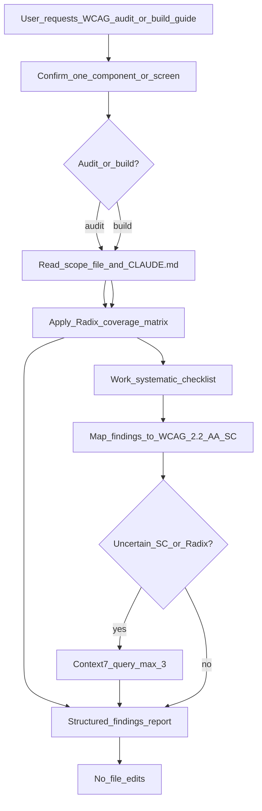

# WCAG Accessibility

Guides **read-only** WCAG 2.2 Level AA accessibility audits and build guides for the `client/` React TypeScript app. Advisory only — explain findings and suggest fixes; do not apply changes.

## Core rules

| Rule | Detail |
|------|--------|
| **One scope per request** | Audit or guide **exactly one** hand-authored component file **or** one screen/view (e.g. `IncidentsView.tsx`). If multiple files are offered, work on the first (or ask once which to prioritise) and offer to continue with the next. |
| **Report only** | **Do not** edit, create, delete, or commit files. **Do not** run `npm test` or Playwright unless the user explicitly asks to *verify* or *fix* — this skill is advisory. |
| **Frontend only** | Scope is `client/` hand-authored code. `client/src/components/ui/**` and `src/lib/utils.ts` are vendored — review **usage**, not internal Radix/shadcn implementation. |
| **WCAG 2.2 AA** | Evaluate against **Level AA** (all Level A + all Level AA success criteria). Note AAA criteria only as **Suggestions**, not failures. |
| **Dual mode** | **Audit** (existing code) or **Build guide** (user is about to build). Ask once if ambiguous; default to **audit** when reviewing existing files. |
| **Read `CLAUDE.md` first** | Treat [`CLAUDE.md`](../../../CLAUDE.md) as source of truth for versions, healthcare context (accessibility non-optional), and component locations. |
| **Positive framing** | Show correct repo patterns (cite existing components) alongside findings. |
| **Synthetic data only** | No PII, patient data, or realistic-looking personal identifiers in examples or Context7 queries. |
| **Output structure** | Use the templates in [Output templates](#output-templates) below. Close every response with: **I have not made any code changes.** |

## Use Context7

When you are **uncertain** about WCAG success criteria interpretation, ARIA patterns, focus-appearance thresholds, or Radix primitive behaviour, fetch documentation instead of guessing.

**Claude Code:**

1. `mcp__context7__resolve-library-id` — pass library name + question
2. `mcp__context7__query-docs` — pass the resolved library ID + specific question

**Cursor (Context7 MCP plugin):**

1. `resolve-library-id` — `libraryName` + `query`
2. `query-docs` — `libraryId` + `query`

**Preferred library IDs:**

| Topic | Library ID |
|-------|------------|
| WCAG 2.2 success criteria, techniques, understanding | `/w3c/wcag` or `/websites/w3_wai_wcag22` |
| Radix primitive accessibility guarantees | `/websites/radix-ui_primitives` |
| shadcn/ui accessibility notes | `/llmstxt/ui_shadcn_llms_txt` |

**When to use** (not on every audit):

- Interpreting WCAG 2.2 criteria added in 2.2 (2.4.11, 2.5.7, 2.5.8, 3.2.6, 3.3.7, 3.3.8)
- Focus appearance (2.4.7, 2.4.11) or target size (2.5.8) thresholds
- ARIA role and live-region patterns for dynamic UI
- Radix focus-trap, portal, or combobox behaviour

**Privacy:** Never send file contents, secrets, PII, or patient data in Context7 queries — only **generic** pattern questions.

**Limit:** At most **three** Context7 tool calls per audit if you still lack an answer after the first round.

When a recommendation depends on a WCAG technique or library API that may have changed, verify with Context7 before stating it as fact.

## Tech stack

Frontend-only versions aligned with [`CLAUDE.md`](../../../CLAUDE.md) and [`client/package.json`](../../../client/package.json):

| Library | Version | A11y relevance |
|---------|---------|----------------|
| React | 19.2.6 | composition, `cloneElement` aria injection |
| TypeScript | 6.0.2 | typed props for labels/ids |
| Tailwind CSS | 4.3.0 | OKLCH tokens, `focus-visible:ring-*`, `motion-reduce:` |
| shadcn/ui (Nova) | — | styled Radix wrappers |
| radix-ui | 1.4.3 | WAI-ARIA primitives |
| @radix-ui/react-slot | 1.2.4 | `asChild` composition |
| lucide-react | 1.17.0 | decorative icons → `aria-hidden` |
| react-router-dom | 7.16.0 | client-side routing, focus on navigation |
| react-day-picker | 10.0.1 | `autoFocus` (not `initialFocus`) |
| date-fns | 4.4.0 | formatted date strings in UI |
| Vite | 8.0.12 | SPA shell; no SSR |

**Explicitly out of scope:** ItemsApi, IncidentsApi, .NET, database, server-rendered HTML.

There is no axe or eslint-a11y plugin in this repo — audits are manual/agent-driven. Defer automated a11y test generation to [react-test-writer](../react-test-writer/SKILL.md) or [playwright-test-writer](../playwright-test-writer/SKILL.md).

## Project layout

```
client/
  index.html                  — page title, <html lang>
  src/
    index.css                 — OKLCH theme tokens (@theme inline)
    App.tsx                   — routes, nav (aria-label="Views")
    main.tsx                  — BrowserRouter
    components/               — hand-authored app components (audit these)
      Badge.tsx
      FormField.tsx
      formFieldUtils.ts       — formFieldErrorId helper
      SelectField.tsx
      DatePickerField.tsx
      DataTable.tsx
      Pagination.tsx
      LoadingState.tsx
      EmptyState.tsx
      ErrorState.tsx
      IncidentsView.tsx       — screen-level composition example
      IncidentForm.tsx
      IncidentCreateView.tsx
      IncidentDetailView.tsx
      IncidentEditView.tsx
      ItemsList.tsx
      ui/                     — shadcn vendor (ESLint-ignored; review usage only)
    componentRegistry.tsx     — component gallery previews
```

## Positive references

Match patterns already used in this repo:

| Component | File | Patterns to cite |
|-----------|------|------------------|
| Badge | [`client/src/components/Badge.tsx`](../../../client/src/components/Badge.tsx) | Text label required; variant icon `aria-hidden`; colour + icon (not colour alone) |
| FormField | [`client/src/components/FormField.tsx`](../../../client/src/components/FormField.tsx) | `htmlFor`/`id`; `cloneElement` aria injection; `role="alert"` errors; decorative `*` |
| SelectField | [`client/src/components/SelectField.tsx`](../../../client/src/components/SelectField.tsx) | `aria-*` on `SelectTrigger`, not `Select.Root` |
| DatePickerField | [`client/src/components/DatePickerField.tsx`](../../../client/src/components/DatePickerField.tsx) | Popover trigger aria; `Calendar` `autoFocus` |
| DataTable | [`client/src/components/DataTable.tsx`](../../../client/src/components/DataTable.tsx) | `role="region"` + `aria-label`; `aria-sort` on `<th>`; sort as `<button>` |
| Pagination | [`client/src/components/Pagination.tsx`](../../../client/src/components/Pagination.tsx) | `<nav aria-label="Pagination">`; `aria-current="page"` |
| LoadingState | [`client/src/components/LoadingState.tsx`](../../../client/src/components/LoadingState.tsx) | `role="status"` + `aria-live="polite"`; `motion-reduce:` spinner |
| EmptyState | [`client/src/components/EmptyState.tsx`](../../../client/src/components/EmptyState.tsx) | Same status/live pattern as LoadingState |
| ErrorState | [`client/src/components/ErrorState.tsx`](../../../client/src/components/ErrorState.tsx) | `role="alert"` wrapper |
| IncidentsView | [`client/src/components/IncidentsView.tsx`](../../../client/src/components/IncidentsView.tsx) | Screen composition: `h1`, filters, state machine, table, pagination |
| Theme tokens | [`client/src/index.css`](../../../client/src/index.css) | OKLCH `--foreground`, `--muted-foreground`, `--ring`, `--destructive` |
| shadcn Button | [`client/src/components/ui/button.tsx`](../../../client/src/components/ui/button.tsx) | `focus-visible:ring-*`, `aria-invalid` styles |

Vitest accessibility assertion patterns: [react-test-writer §6](../react-test-writer/SKILL.md). Reference tests: [`FormField.test.tsx`](../../../client/src/components/FormField.test.tsx), [`Badge.test.tsx`](../../../client/src/components/Badge.test.tsx), [`EmptyState.test.tsx`](../../../client/src/components/EmptyState.test.tsx).

### Known repo gaps (severity examples)

Documented in [`learning-notes.md`](../../../learning-notes.md) — use as calibration, not assumptions on unscanned files:

- Loading refetch unmounts table → keyboard focus loss (2.4.11 / focus management)
- Link underline only on hover in some views (1.4.1 use of colour)
- Legacy Items form uses implicit label nesting (works with `getByLabelText`, inconsistent with `FormField` pattern)
- `ErrorState` retry button uses custom classes without shadcn `focus-visible:ring-*`

## Radix / shadcn coverage matrix

Radix Primitives follow WAI-ARIA authoring practices and handle ARIA attributes, role attributes, focus management, and keyboard navigation for complex widgets. shadcn/ui adds Tailwind styling and focus-ring tokens on top. **This complements rather than replaces** manual checks for labels, contrast, live regions, headings, and page-level focus.

```mermaid
flowchart LR
  subgraph radixCovers [Radix_shadcn_handles]
    roles[ARIA_roles_and_states]
    kbd[Keyboard_patterns_per_WAI_ARIA_APG]
    focusTrap[Focus_trap_in_portals]
    roving[Roving_tab_index_in_menus]
    expanded[aria-expanded_aria-controls]
  end
  subgraph manualChecks [App_code_must_verify]
    labels[Visible_labels_and_error_copy]
    contrast[OKLCH_token_contrast]
    liveRegions[Loading_error_empty_live_regions]
    headings[Page_heading_hierarchy]
    sortAnnounce[Table_sort_state_communication]
    routeFocus[Route_change_focus_management]
    targetSize[Hit_target_24px_minimum]
    motion[motion-reduce_degradation]
    colourAlone[Status_not_by_colour_alone]
  end
  radixCovers --> manualChecks
```



| Area | Radix/shadcn provides | Still manual in this repo |
|------|----------------------|---------------------------|
| Select | `combobox` role, typeahead, `aria-expanded`, portal positioning | Label via `SelectField`; `aria-describedby`/`aria-invalid`/`aria-required` on **trigger**; option text clarity |
| Popover / Calendar | Focus into content, dismiss on Escape | `autoFocus` on Calendar; trigger label; date format readability |
| Button (shadcn) | Focus ring via `focus-visible:ring-*` | Visible label text; `asChild` + Link composition; disabled state copy |
| Dialog (if added) | Focus trap, `aria-modal`, restore focus | Title/description content; do not open on hover alone |
| Checkbox / Radio (if added) | Checked state, keyboard toggle | Group labels (`fieldset`/`legend` or `aria-labelledby`) |

### shadcn / Radix gotchas

**Select — `aria-*` on `SelectTrigger`, not `Select.Root`**

Radix `Select.Root` renders **no DOM node**. `FormField` uses `cloneElement` to inject `aria-describedby`, `aria-invalid`, and `aria-required` onto its single child — that only works when the child is a real element.

In `SelectField.tsx`, all `aria-*` attributes are placed on `SelectTrigger`. Audits and build guides for selects must verify aria on the trigger (`combobox` role), not assume aria lives on a wrapper around `Select`.

**Calendar — `autoFocus`, not `initialFocus`**

react-day-picker **v10** (`react-day-picker` 10.0.1): use `autoFocus` on the shadcn `Calendar` inside `DatePickerField`. The old `initialFocus` prop is **silently ignored** — it does not throw.

**DataTable — `aria-label` on region wrapper, not `<table>`**

Query with `getByRole('region', { name: 'Data table' })`. Sort state is communicated via `aria-sort` on `<th>` headers and visible sort indicators (`aria-hidden`).

**Vendor files**

`client/src/components/ui/**` and `src/lib/utils.ts` are ESLint-ignored. Audit behaviour through hand-authored wrappers (`SelectField`, `DatePickerField`, `FormField`), not vendor internals.

## WCAG 2.2 AA success criteria reference

Level AA conformance requires **all Level A and all Level AA** criteria below. Each row: SC number, title, React/Tailwind check for this repo, applicability.

Use Context7 for technique detail when a row is uncertain. Mark **N/A** only with a brief reason.

### 1. Perceivable

| SC | Title | Check in this repo | Applies |
|----|-------|-------------------|---------|
| 1.1.1 | Non-text Content | Decorative icons `aria-hidden`; Badge icons paired with text; spinner decorative | Applies |
| 1.2.1–1.2.5 | Audio/Video alternatives | No audio/video content | N/A — no media |
| 1.3.1 | Info and Relationships | Semantic HTML; `<table>`/`<th scope="col">`; `FormField` labels; heading hierarchy | Applies |
| 1.3.2 | Meaningful Sequence | DOM order matches visual reading order; filters before table | Applies |
| 1.3.3 | Sensory Characteristics | Instructions not shape/colour-only; Badge uses icon + text | Applies |
| 1.3.4 | Orientation | No orientation lock | N/A — responsive web app |
| 1.3.5 | Identify Input Purpose | `autocomplete` on personal-data fields | Future — not in current forms |
| 1.4.1 | Use of Colour | Badge variants; error `text-destructive`; links identifiable without colour alone | Applies |
| 1.4.2 | Audio Control | No auto-playing audio | N/A |
| 1.4.3 | Contrast (Minimum) | Text on OKLCH tokens: 4.5:1 normal, 3:1 large (`text-lg`+) | Applies |
| 1.4.4 | Resize Text | rem/em sizing; no `px` font locks blocking 200% zoom | Applies |
| 1.4.5 | Images of Text | No images of text in UI | N/A |
| 1.4.10 | Reflow | Tailwind responsive breakpoints; `overflow-x-auto` for tables at 320px | Applies |
| 1.4.11 | Non-text Contrast | Borders, focus rings, control boundaries: 3:1 against adjacent colours | Applies |
| 1.4.12 | Text Spacing | No CSS blocking user text-spacing overrides | Applies |
| 1.4.13 | Content on Hover or Focus | Tooltips/menus dismissible, hoverable, persistent (if used) | Applies if hover/focus content added |

### 2. Operable

| SC | Title | Check in this repo | Applies |
|----|-------|-------------------|---------|
| 2.1.1 | Keyboard | All actions operable via keyboard; sort buttons; pagination; Radix selects | Applies |
| 2.1.2 | No Keyboard Trap | Radix portals release on Escape; verify custom `tabIndex` (e.g. DataTable region) | Applies |
| 2.1.4 | Character Key Shortcuts | Single-key shortcuts | N/A — none implemented |
| 2.2.1 | Timing Adjustable | No session timeouts | N/A — no timed sessions |
| 2.2.2 | Pause, Stop, Hide | Auto-updating content | N/A — no auto-rotating content |
| 2.3.1 | Three Flashes | No flashing content | N/A |
| 2.4.1 | Bypass Blocks | Skip to main content link | Applies — skip link not yet implemented; report as Minor at component scope, Major at app-shell scope. |
| 2.4.2 | Page Titled | `index.html` title; consider per-route titles | Applies (app shell) |
| 2.4.3 | Focus Order | Logical tab sequence: nav → filters → table → pagination | Applies |
| 2.4.4 | Link Purpose | Link text describes destination (e.g. incident title in table) | Applies |
| 2.4.5 | Multiple Ways | Nav links to Items, Incidents, Components | Applies (app level) |
| 2.4.6 | Headings and Labels | `h1` per view; `FormField`/`SelectField` labels | Applies |
| 2.4.7 | Focus Visible | `focus-visible:ring-*` on shadcn Button; custom buttons need same pattern | Applies |
| 2.4.11 | Focus Not Obscured (Minimum) | **WCAG 2.2** — focused element not fully hidden by sticky headers/overlays | Applies |
| 2.5.1 | Pointer Gestures | Multipoint/path gestures | N/A — no multipoint gestures |
| 2.5.2 | Pointer Cancellation | Native `<button>` click on up-event | Applies |
| 2.5.3 | Label in Name | Visible label text included in accessible name | Applies |
| 2.5.4 | Motion Actuation | Device motion input | N/A |
| 2.5.7 | Dragging Movements | **WCAG 2.2** — non-drag alternative if drag UI added | N/A — no drag UI |
| 2.5.8 | Target Size (Minimum) | **WCAG 2.2** — 24×24 CSS px minimum; Pagination, sort buttons, select triggers | Applies |

### 3. Understandable

| SC | Title | Check in this repo | Applies |
|----|-------|-------------------|---------|
| 3.1.1 | Language of Page | `<html lang="en">` in `index.html` | Applies |
| 3.1.2 | Language of Parts | Mixed-language content | N/A — English only |
| 3.2.1 | On Focus | No unexpected context change on focus alone | Applies |
| 3.2.2 | On Input | Filter changes reload data — expected; flag if surprising | Applies |
| 3.2.3 | Consistent Navigation | `App.tsx` nav order and labels stable across routes | Applies |
| 3.2.4 | Consistent Identification | Same function, same label (e.g. "Try again" / "Retry") | Applies |
| 3.2.6 | Consistent Help | **WCAG 2.2 (Level A)** — help in consistent location | N/A — no help mechanism |
| 3.3.1 | Error Identification | `role="alert"`; `aria-invalid` on controls | Applies |
| 3.3.2 | Labels or Instructions | `FormField`, `SelectField`; placeholder not sole label | Applies |
| 3.3.3 | Error Suggestion | Validation copy (`Name is required.`, etc.) | Applies |
| 3.3.4 | Error Prevention | Confirm before destructive/legal/financial actions | Future |
| 3.3.7 | Redundant Entry | **WCAG 2.2 (Level A)** — avoid re-entering prior data | Future — multi-step forms |
| 3.3.8 | Accessible Authentication (Minimum) | **WCAG 2.2 (Level AA)** — no cognitive function test only | N/A — no auth |

### 4. Robust

| SC | Title | Check in this repo | Applies |
|----|-------|-------------------|---------|
| 4.1.1 | Parsing | Valid HTML from React | N/A — removed in WCAG 2.2; issues now covered by 1.3.1 and 4.1.2 |
| 4.1.2 | Name, Role, Value | Radix roles; custom `role="region"` on DataTable; state exposed to AT | Applies |
| 4.1.3 | Status Messages | `role="status"` + `aria-live="polite"` (Loading, Empty); `role="alert"` (Error) | Applies |

### AAA criteria (Suggestions only)

Report these as **Suggestion**, not AA failures:

| SC | Title |
|----|-------|
| 2.4.12 | Focus Not Obscured (Enhanced) |
| 2.4.13 | Focus Appearance |
| 3.3.9 | Accessible Authentication (Enhanced) |

## Systematic audit checklist

Work through these **in order** for each component or screen. Record only failures and suggestions — do not list passing items unless summarising in Positive notes.

1. **Scope and context** — component vs screen; states present (loading, error, empty, populated).
2. **Semantic HTML** — correct elements (`button` not `div`, `table`/`th`/`td`, `nav`, `section`); logical heading levels (`h1` once per view).
3. **ARIA patterns** — correct roles; no redundant ARIA; decorative `aria-hidden`; live regions for dynamic status.
4. **Forms** (if present) — `htmlFor`/`id` label association; `aria-describedby` → error id; `aria-invalid`; `aria-required`; Radix `aria-*` on trigger not root.
5. **Colour and contrast** — OKLCH token pairs from `index.css`; Badge/status not colour-only; link affordance without hover-only cues.
6. **Focus management** — visible focus on all interactives; focus not lost when content swaps (loading → table); portal focus return after close.
7. **Keyboard navigation** — Tab order logical; Enter/Space on buttons; Escape dismisses overlays; sortable headers keyboard-operable.
8. **Responsive layout** — reflow at 320px width; `overflow-x-auto` for wide tables; stacked filters on small screens.
9. **Graceful degradation** — `motion-reduce:` on animations; content usable without hover; no information conveyed by motion alone.
10. **Target size (2.5.8)** — pointer targets ≥ 24×24 CSS px (Pagination, sort buttons, select triggers); inline text links exempt.
11. **Focus appearance / not obscured (2.4.7, 2.4.11)** — focus ring visible against background; sticky UI does not fully obscure focused control.
12. **Dynamic content** — loading/error transitions announced; filter changes update table; pagination state communicated (`aria-current`).
13. **Routing** (screens only) — `h1` present; page title meaningful; focus management on route change (Suggestion if absent).

### Screen-specific: state machine

For screens like `IncidentsView`, additionally audit:

- Loading replaces interactive table → **focus loss risk** when refetching with existing data visible
- Filter controls remain mounted while table swaps — tab order stability
- Table cell links: purpose clear from link text alone
- Empty vs error vs populated: correct live region (`status` vs `alert`)

### Component-specific quick checks

| Component | Key checks |
|-----------|------------|
| Badge | `children` text present; icon `aria-hidden`; variant distinguishable without colour |
| FormField | `cloneElement` aria injection; error `role="alert"`; required `*` decorative only |
| SelectField | All `aria-*` on `SelectTrigger`; `id` matches label `htmlFor` |
| DatePickerField | Button trigger labelled; `autoFocus` on Calendar; formatted date readable |
| DataTable | Region label; `aria-sort`; sort buttons keyboard + focus ring |
| Pagination | `nav` label; `aria-current="page"`; prev/next `aria-label`; target size |
| LoadingState / EmptyState | `role="status"` + `aria-live="polite"` |
| ErrorState | `role="alert"`; retry button focus visible |

## Build guide (new components)

When the user is **building** rather than auditing, output a **Build guide** (see [Output templates](#output-templates)). Do not audit code that does not exist yet — guide the design instead.

### Pre-build checklist

- [ ] Choose Radix primitive for interactive widgets (Select, Popover, Dialog) — do not rebuild keyboard behaviour from scratch
- [ ] Plan `id` + `htmlFor` label pairs; error id via `formFieldErrorId` from [`formFieldUtils.ts`](../../../client/src/components/formFieldUtils.ts)
- [ ] Plan four UI states where applicable: loading, error, empty, populated — each with correct live region
- [ ] Plan non-colour status indicators (icons + text for badges/chips)
- [ ] Plan focus behaviour when async content replaces interactive UI (avoid unmounting focused elements)
- [ ] Verify target sizes ≥ 24×24 px for icon-only or compact controls
- [ ] Use shadcn `Button` or match its `focus-visible:ring-*` pattern on custom buttons
- [ ] Place hand-authored components in `client/src/components/` — never in `ui/`

### Patterns to copy

| Need | Copy from | Why |
|------|-----------|-----|
| Labelled input with validation | `FormField` | `htmlFor`, aria injection, error alert |
| Dropdown select | `SelectField` | Radix Select + aria on trigger |
| Date input | `DatePickerField` | Popover + Calendar + `autoFocus` |
| Status chip | `Badge` | Icon + text, not colour alone |
| Sortable data grid | `DataTable` | Region, `aria-sort`, button headers |
| Page navigation | `Pagination` | `nav` landmark, `aria-current` |
| Loading feedback | `LoadingState` | `role="status"`, `motion-reduce` |
| Empty feedback | `EmptyState` | Polite live region |
| Error feedback | `ErrorState` | `role="alert"` |

### Anti-patterns to avoid

- `outline-none` or `outline: none` without `focus-visible` ring replacement
- `aria-*` on Radix root components that render no DOM node (`Select.Root`)
- Placeholder as the only visible label
- Colour-only severity, status, or error indication
- Unmounting focusable UI during loading without moving focus to a status region
- `initialFocus` on Calendar — use `autoFocus` (react-day-picker v10)
- `div` with `onClick` instead of `<button type="button">`
- Icon-only buttons without `aria-label`
- Custom interactive widgets without keyboard support

## Severity calibration

| Severity | WCAG audit meaning | Examples in this repo |
|----------|-------------------|----------------------|
| **Blocker** | Fails Level A or AA SC; blocks assistive-tech users from a core task | Missing label on form control; keyboard-inaccessible custom control; primary text contrast below 4.5:1 |
| **Major** | Fails AA SC with workaround, or systemic pattern risk | Focus lost when table unmounts on reload; link affordance hover-only; retry button missing visible focus ring; Skip link missing at app-shell scope |
| **Minor** | Partial compliance, edge state, or inconsistency | Heading level skip inside a card; redundant `tabIndex={0}` on region; inconsistent label pattern (Items vs Incidents forms); Skip link (component-scope only) |
| **Suggestion** | AAA, future-proofing, tooling, or test coverage | route-change focus management; axe in CI; AAA focus appearance (2.4.13) |

Each finding must include:

- **Where** — line number or element
- **SC** — WCAG success criterion number and title
- **Issue** — what fails and who is affected
- **Suggested fix** — concrete pattern (code snippet or edit description) — advisory only

## Workflow for each request

1. **Confirm scope and mode** — one component or screen; audit vs build guide. Ask once if ambiguous; default to audit for existing files.
2. **Classify** — component (`client/src/components/<Name>.tsx`) vs screen/view (e.g. `IncidentsView.tsx`, route shell in `App.tsx`).
3. **Skim `CLAUDE.md`** if not already in context.
4. **Read only what is in scope** — the target file; for screens, include inline helpers defined in the same file. Do not read unrelated files except positive references cited in findings.
5. **Apply Radix coverage matrix** — separate what Radix handles from what app code owns.
6. **Work checklist by mode** — **Audit mode:** full 13-step systematic checklist (§ Systematic audit checklist); map each finding to WCAG 2.2 AA SC numbers. **Build mode:** pre-build checklist only (§ Build guide).
7. **Context7** — if uncertain about SC interpretation or Radix behaviour (max three calls).
8. **Write report** using the appropriate template below.
9. **Close** with: **I have not made any code changes.**
10. **Offer next scope** — do not implement fixes unless the user asks.

### Audit flow



## Output templates

### Audit report (default)

```markdown
## Accessibility audit: <ComponentOrScreen>

### Summary
<1–2 sentences: overall AA conformance risk>

### Checklist coverage
<Brief: which checklist sections were in scope>

### Findings

#### [Blocker|Major|Minor|Suggestion] — <short title>
- **Where:** line N (or element)
- **SC:** 1.4.3 Contrast (Minimum)
- **Issue:** ...
- **Suggested fix:** ...

### Positive notes
<what is done well, if any>

### Next scope
<Ready to audit `<next>` when you are.>

I have not made any code changes.
```

### Build guide report

```markdown
## Build guide: <planned component or screen>

### Recommended patterns
<which repo components to copy and why>

### Pre-build checklist
<checked items with guidance for this specific build>

### WCAG 2.2 AA considerations
<SCs most likely to apply, with concrete implementation notes>

### Radix component choice
<which primitive to use, what the app code still owns>

I have not made any code changes.
```

## Related skills

| Skill | When to use instead |
|-------|---------------------|
| [code-reviewer](../code-reviewer/SKILL.md) | Full-stack review including TypeScript conventions, EF Core, and general frontend rules — not a dedicated WCAG pass |
| [react-test-writer](../react-test-writer/SKILL.md) | Writing Vitest accessibility assertions after fixes are implemented |
| [playwright-test-writer](../playwright-test-writer/SKILL.md) | Browser-level journey accessibility checks (Week 5) |

For a thorough accessibility review, use **this skill**. For merge-readiness across the whole stack, use **code-reviewer** first, then **wcag** on hand-authored UI files.
