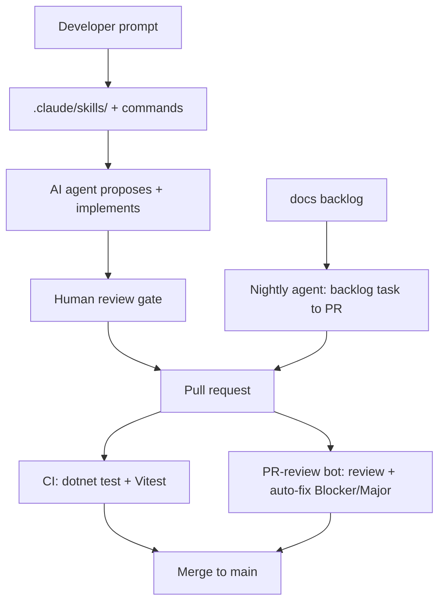

# radar-practice

[](https://github.com/Collins1892/radar-practice/actions/workflows/ci.yml)
[](https://context7.com)

A full-stack project built to demonstrate **agentic AI development** — directing
AI coding agents (Claude Code and Cursor) to scaffold, extend, test, and maintain
a real application under human review. The story here is the *workflow*; the app
is the evidence that it holds up.

This is not a production system. It is a deliberately small, healthcare-flavoured
codebase that shows how AI-assisted development behaves in practice: what agents
do well, where they stall, and why a human review gate stays essential.

## What this project demonstrates

- **Agent-built, human-reviewed software.** Three modules were scaffolded, extended, and refactored by agents under a strict review gate — the agent proposes and implements, the developer reviews, tests, and decides what to commit.
- **A reusable skill system.** Seven repo-level [agent skills](.claude/skills/) and four [slash commands](.claude/commands/) make agent output consistent across sessions and developers, rather than re-deriving conventions each time.
- **Automated quality gates.** A PR-review bot reviews every diff and auto-fixes Blocker/Major findings; a nightly autonomous agent picks a backlog task, implements it under a hard budget, runs the full test suite, and raises a PR.
- **Legacy-to-modern migration.** The Audits module is a real .NET 4 / AngularJS → .NET 8 / React 19 migration with the before-state preserved, so the diff itself tells the story.
- **Regulated-context discipline.** Prompt hygiene, no PII, and review-every-diff habits are built into the workflow, not bolted on.

## The application

Three vertical-slice modules behind one shared React client:

- **Items** — a demo learning scaffold (list and add only, legacy styling, warning banner on `/items`). Practice surface only; never used as a template.
- **Incidents** — a reference feature module: standalone API + full React CRUD (list, filters, sort, pagination, detail, create/edit, soft delete).
- **Audits** — a reference module migrated from `legacy/`: same shape as Incidents, different domain, reusing the shared component library.

Incidents and Audits are the structural templates for new work; Items and
`legacy/` are reference-only. See [CLAUDE.md](CLAUDE.md) for the full agent-oriented
repo map and the reference-module rule.

| Layer | Stack |
|-------|-------|
| Items API | .NET 8 minimal API, repository pattern, EF Core + SQLite (`app.db`), port 5133 — demo scaffold |
| Incidents API | .NET 8 minimal API, EF Core + SQLite (`incidents.db`), port 5134, soft delete via `RecordStatus`, full CRUD |
| Audits API | .NET 8 minimal API, EF Core + SQLite (`audits.db`), port 5135, soft delete — migrated from `legacy/` |
| Backend tests | xUnit, `TestWebApplicationFactory` (in-memory SQLite per project), NSubstitute |
| Frontend | React 19, TypeScript, Vite, Tailwind CSS 4, shadcn/ui, react-router-dom (`/` redirects to `/components`) |
| Frontend tests | Vitest + `@testing-library/react`; Playwright e2e (9 tests) via the nightly suite |
| CI | GitHub Actions — `dotnet test` (all three APIs) + Vitest on push/PR to `main`; Playwright e2e nightly only |

Each API owns its own SQLite database — all local only, never committed.

### Illustrative layout

Not an exhaustive inventory — see [CLAUDE.md](CLAUDE.md) for the full repo map.

```
radar-practice/
├── RadarPractice.sln       # groups all six .NET projects
├── ItemsApi/ + .Tests/     # demo scaffold — GET/POST /items
├── IncidentsApi/ + .Tests/ # reference module — full CRUD + soft delete
├── AuditsApi/ + .Tests/    # reference module — migrated from legacy/
├── legacy/                 # .NET 4 / AngularJS Audits — before-state, retained
├── client/                 # React + TypeScript + Vite (components, hooks, api, e2e)
├── .claude/skills/         # 7 agent skills
├── .claude/commands/       # /review, /standup, /observations, /tidy
├── .github/workflows/      # ci, pr-review, nightly-agent, nightly-e2e
├── .github/scripts/        # pr-review.js, nightly-agent.js, sensitive-paths.js
└── docs/                   # backlog, friction log, AI observations, security posture
```

## The agentic workflow as a system

The skills, commands, CI, and bots are not separate features — they form one
loop with a human review gate at its centre.



- **Skills + commands** narrow agent output toward repo conventions (one test per prompt, repository pattern, accessibility built in).
- **CI** ([`ci.yml`](.github/workflows/ci.yml)) runs backend + frontend tests on every push/PR.
- **PR-review bot** ([`pr-review.yml`](.github/workflows/pr-review.yml)) reviews each diff against the `code-reviewer` skill, auto-fixes Blockers/Majors (up to 3 attempts, full test suite before each commit), and comments findings.
- **Nightly agent** ([`nightly-agent.yml`](.github/workflows/nightly-agent.yml)) plans-then-acts on the lowest-ID open backlog task under a 10-call budget, and raises a PR.
- **Nightly e2e** ([`nightly-e2e.yml`](.github/workflows/nightly-e2e.yml)) runs the Playwright suite against all three APIs + Vite.

For the longer-form lessons behind this — what agents do well, where they stall,
Cursor vs Claude Code, skill evals, and accessibility — see
[docs/ai-workflow-observations.md](docs/ai-workflow-observations.md).

## Setup

### Prerequisites

- [.NET 8 SDK](https://dotnet.microsoft.com/download/dotnet/8.0)
- [Node.js 24](https://nodejs.org/)

### Run the APIs

```bash
cd ItemsApi && dotnet run        # http://localhost:5133
cd IncidentsApi && dotnet run    # http://localhost:5134
cd AuditsApi && dotnet run       # http://localhost:5135
```

### Run the frontend

```bash
cd client
npm install
npm run dev                      # http://localhost:5173
```

Vite proxies `/items` to the Items API on 5133. Incidents and Audits use direct
CORS fetch (not proxied). To point at the APIs directly, copy
`client/.env.example` to `client/.env` and set `VITE_API_URL`,
`VITE_INCIDENTS_API_URL`, `VITE_AUDITS_API_URL` as needed. Copy the root
`.env.example` to `.env` and add `ANTHROPIC_API_KEY` for local Claude Code and the
automation scripts.

### Run the tests

```bash
# Backend — all six .NET projects
dotnet test RadarPractice.sln

# Frontend — Vitest (from client/)
cd client && npm test

# End-to-end — Playwright (from client/; webServer boots all 3 APIs + Vite)
cd client && npx playwright test
```

The Playwright suite is 9 tests (3 smoke + items, components, 3 incidents, and 1
audit journey). It runs nightly in CI via
[`nightly-e2e.yml`](.github/workflows/nightly-e2e.yml), not on PR builds.

## Going deeper

- [CLAUDE.md](CLAUDE.md) — canonical agent boot guide: repo map, conventions, automation, boundaries.
- [docs/ai-workflow-observations.md](docs/ai-workflow-observations.md) — lessons from building with agents.
- [learning-notes.md](learning-notes.md) — the full daily log.
- [docs/workflow-friction.md](docs/workflow-friction.md) — running workflow-friction log.
- [docs/agentic-workflow-security.md](docs/agentic-workflow-security.md) — agentic-workflow security posture.
- [docs/nightly-agent-backlog.md](docs/nightly-agent-backlog.md) / [docs/nightly-agent-completed.md](docs/nightly-agent-completed.md) — autonomous-agent task log.

## Known gaps

Kept visible on purpose: the .NET projects have no secret-scanning equivalent to
the client's `eslint-plugin-no-secrets` (flag backend secrets manually); the
IncidentsApi screens still use an inline `useState`/`useEffect` data-fetching
pattern pending a hooks retrofit (backlog task T58); and the Items module retains
its legacy CSS by design as a demo scaffold.
