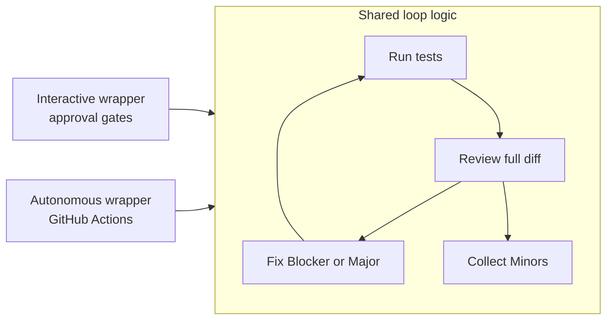
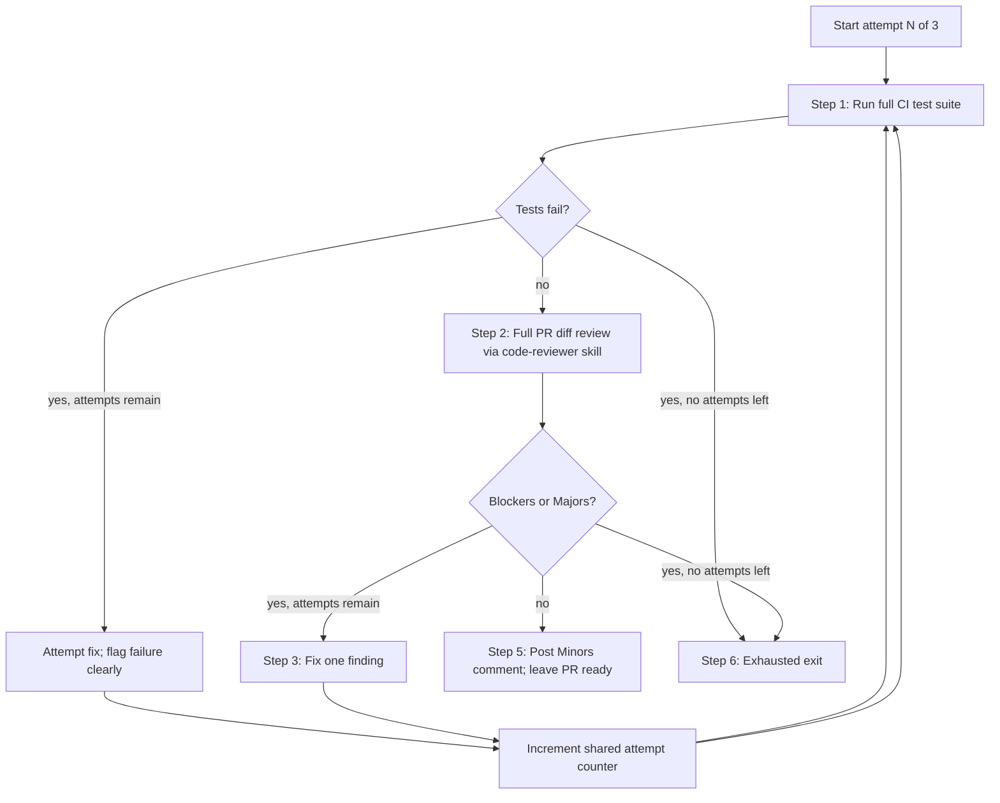

# Implement-Test-Review Loop Pattern

The shared loop used by automated PR review, the nightly autonomous agent,
and manual in-session work in this repository. Same logic, different wrappers
depending on context.

Related: [code-reviewer skill](../.claude/skills/code-reviewer/SKILL.md)
(advisory review only), [`/review` command](../.claude/commands/review.md)
(single-pass review, no fixes), [CI workflow](../.github/workflows/ci.yml)
(canonical test suite).

## 1. Purpose

The **implement-test-review loop** bundles four core activities into one
bounded cycle, expanded into a six-step sequence in Section 3:

1. Run the test suite.
2. Review the **full PR diff** against the
   [code-reviewer skill](../.claude/skills/code-reviewer/SKILL.md).
3. Fix Blockers and Majors one at a time, re-running tests and re-reviewing
   after each fix.
4. Collect Minors (and Suggestions) for human review at the end — never
   auto-actioned.

**Why it exists:** Autonomous agents can fix code, but unbounded self-correction
is unsafe. The loop provides a bounded retry with a clear exit: either the PR
is clean and ready, or it is marked draft with specific unresolved findings and
a human-needed signal. Minors stay proposed, not written to backlog, so the
developer remains the gate on durable work.

**Same brain, two wrappers:** The loop logic is identical everywhere. Only the
*wrapper* changes — interactive sessions wait for approval before applying
fixes; autonomous workflows apply fixes and post comments directly.



The [code-reviewer skill](../.claude/skills/code-reviewer/SKILL.md) alone is
**read-only and advisory** — it explains findings and suggests fixes but does
not run tests or edit code. The loop **extends** that skill: it runs tests,
applies Blocker/Major fixes, and manages attempt limits and output formats.

## 2. Loop modes

| Mode | Context | Approval | Output |
|------|---------|----------|--------|
| **Interactive** | Claude Code or Cursor in-session | Propose each fix; wait for explicit developer approval before applying | Shown in chat; developer commits |
| **Autonomous** | GitHub Actions (PR review job, nightly agent) | None — fixes applied directly | PR comments, draft status via GitHub API |

Mode is determined by **context**, not by changing the loop logic. The
sequence, attempt counter, severity handling, and review scope are the same
in both modes.

## 3. Full sequence



**Step 1 — Run tests.** Execute the full CI test suite (see
[Test failure handling](#5-test-failure-handling)). If tests fail, attempt to
fix the failure, **flag the failure clearly** in the output (do not silently
retry), increment the shared attempt counter, and re-run from Step 1. If tests
still fail after 3 attempts, proceed to Step 6 (the exhausted-exit path),
reporting the test failures the same way as unresolved Blockers/Majors.

**Step 2 — Review.** Run a full diff review against the
[code-reviewer skill](../.claude/skills/code-reviewer/SKILL.md). Always review
the **full PR diff** (`git diff main...HEAD` or equivalent), not just files
changed in the current iteration. Read [CLAUDE.md](../CLAUDE.md) if not already
in context. Use the skill's severity levels and output template.

**Step 3 — Fix Blockers and Majors.** If Blockers or Majors are found, fix
**one** finding at a time, increment the shared attempt counter, re-run tests
(Step 1), and re-review the **full PR diff from scratch** (Step 2). Do not
review only the file just edited.

**Step 4 — Repeat up to 3 attempts.** The shared attempt counter limits the
whole loop (see [Attempt counter](#4-attempt-counter)).

**Step 5 — Clean exit.** If no Blockers or Majors remain within 3 attempts,
collect all Minors (and Suggestions). In autonomous mode, post as a single PR
comment and leave the PR ready. In interactive mode, present the Minors list
once in chat.

**Step 6 — Exhausted exit.** If Blockers or Majors remain after 3 attempts,
or tests still fail after 3 attempts: in autonomous mode, mark the PR as
**draft** and post a comment with the specific unresolved findings and a clear
**needs human review** message. In interactive mode, report the unresolved
findings with the same human-review message — do not mark draft.

**Suggestions:** Treat like Minors — collect only at the end; never
auto-actioned.

## 4. Attempt counter

- **Shared** across test-failure fixes and Blocker/Major fixes — one counter
  for the entire loop, not separate counters per activity.
- **Starts at 1**, **limit is 3**.
- Each cycle that attempts a fix (test failure or Blocker/Major) consumes an
  attempt before re-running tests.
- **3 is a starting value**, not a fixed rule. Tune from morning standup
  observations (see [Tuning](#8-tuning)).

Example: attempt 1 fails a test and is fixed; attempt 2 passes tests but
finds a Blocker and fixes it; attempt 3 passes tests and review is clean —
loop exits at Step 5.

## 5. Test failure handling

When tests fail:

1. **Attempt to fix** the failure.
2. **Flag the failure clearly** in output — which suite, which test, and a
   summary of the error. Do not silently retry.
3. **Increment** the shared attempt counter.
4. **Re-run** the full test suite from Step 1.

Test commands match
[`.github/workflows/ci.yml`](../.github/workflows/ci.yml). On a clean
checkout, run `npm ci` in `client/` before `npm test`.

```bash
dotnet test ItemsApi.Tests/ItemsApi.Tests.csproj --verbosity normal
dotnet test IncidentsApi.Tests/IncidentsApi.Tests.csproj --verbosity normal
cd client && npm test
```

Run all three on every loop iteration unless the PR diff is provably scoped
to one area (e.g. frontend-only) — when in doubt, run the full suite.

For automated PR review, the review job is gated behind `needs: test` in CI
so the agent does not spend calls on code that already failed CI. After the
agent applies fixes locally, it must re-run tests itself.

## 6. Review pass

| Rule | Detail |
|------|--------|
| **Scope** | Always the **full PR diff**, never just changed files in the current iteration |
| **Skill** | Always [`.claude/skills/code-reviewer/SKILL.md`](../.claude/skills/code-reviewer/SKILL.md) — severity, rules, output template |
| **Blockers / Majors** | Trigger the fix loop (Step 3); one fix per iteration |
| **Minors / Suggestions** | Collected only — never auto-fixed, never auto-added to backlog |

After each Blocker/Major fix, discard the previous review and re-review the
**entire diff from scratch**. A fix in one file may affect findings elsewhere.

Calibrate effort per the skill: use **think hard** for WCAG-heavy UI or
large cross-cutting diffs.

## 7. Output formats

### Minors comment (clean exit — Step 5)

Posted **once** when the loop concludes with no remaining Blockers or Majors.
Proposed list only — not auto-actioned.

```markdown
## Loop review — Minors for consideration

**Attempts used:** N of 3
**Status:** PR ready — no Blockers or Majors remain.

The following Minor findings are proposed for your review. They have **not**
been applied or added to any backlog.

### Minors

- **[Minor] — <short title>**
  - **Where:** `<file>` line N
  - **Rule:** <Universal|Backend|Frontend> — <rule name>
  - **Issue:** ...
  - **Suggested fix:** ...

### Suggestions

- **[Suggestion] — <short title>**
  - **Where:** ...
  - **Rule:** ...
  - **Issue:** ...
  - **Suggested fix:** ...
```

### Draft PR comment (exhausted exit — Step 6)

Posted when 3 attempts are exhausted with unresolved Blockers or Majors.

```markdown
## Loop review — needs human review

**Attempts used:** 3 of 3
**Status:** PR marked as **draft**. Do not merge without human review.

The loop could not resolve the following findings within the attempt limit.

### Unresolved Blockers / Majors

For test-failure exhaustion, adapt this section — list the failing suite, test name, and error summary instead of Blockers/Majors.

- **[Blocker|Major] — <short title>**
  - **Where:** `<file>` line N
  - **Rule:** <Universal|Backend|Frontend> — <rule name>
  - **Issue:** ...
  - **Suggested fix:** ...

---

**Needs human review.** Please resolve the findings above manually, then
remove draft status when ready.
```

### Interactive mode (per fix)

Before applying any fix in interactive mode, show the proposed change and
wait for approval:

```markdown
## Proposed fix — attempt N of 3

**Finding:** [Blocker|Major] — <short title>
**Where:** `<file>` line N

**Change:**
<diff or concrete description of the edit>

---

**Awaiting approval before applying.** Reply to confirm or redirect.
```

Do not apply the fix until the developer explicitly approves.

## 8. Tuning

The attempt limit (3) and fix strategy are **tuned from morning standup
observations**, not fixed upfront. After each Week 5+ standup (see
[`/standup`](../.claude/commands/standup.md)), review:

- Did the loop converge in one pass, or churn through all 3 attempts?
- Did it mark draft correctly when stuck?
- Were Minors useful or noise?

**Log tuning decisions in `docs/ai-observations.md` (create on first entry)** —
what was observed and what was changed (e.g. attempt limit raised to 4,
stricter scope check added).

Workflow friction that informs loop changes may also be logged in
[`docs/workflow-friction.md`](workflow-friction.md) via
[`/observations`](../.claude/commands/observations.md).

## 9. How to reference in prompts

Copy-paste these snippets into Claude Code sessions or GitHub Actions
workflow prompts. Replace placeholders in angle brackets.

### Interactive mode (Claude Code / Cursor)

```
Follow docs/loop-pattern.md — interactive mode.

Mode: interactive. Propose each fix and wait for my explicit approval
before applying. Do not commit unless I ask.

Scope: full PR diff (git diff main...HEAD).
- Committed branch or PR: git diff main...HEAD
- Uncommitted in-session changes (working tree): git diff main
  (or git diff for unstaged changes)
Review against: .claude/skills/code-reviewer/SKILL.md
Conventions: CLAUDE.md

Attempt counter: starts at 1, limit 3 (shared across test fixes and
Blocker/Major fixes).

Sequence:
1. Run full CI test suite. If tests fail — flag clearly, attempt fix,
   increment counter, re-run. If still failing after 3 attempts, proceed
   to step 6.
2. Review full PR diff using code-reviewer severity (Blocker/Major/Minor/
   Suggestion).
3. Fix one Blocker or Major at a time; after each fix, re-run tests and
   re-review full diff from scratch.
4. Repeat up to 3 attempts (shared counter across test fixes and
   Blocker/Major fixes).
5. If clean within 3 attempts — collect Minors/Suggestions and present
   as a single proposed list (do not auto-action).
6. If not clean after 3 attempts (unresolved Blockers/Majors or
   persistent test failures) — report unresolved findings with a clear
   "needs human review" message.

PR / branch: <branch name or "working tree">
```

### Autonomous mode (GitHub Actions)

```
Follow docs/loop-pattern.md — autonomous mode.

Mode: autonomous. Apply fixes directly. No approval gates.

Note: commit/push, PR comments, and draft-marking apply only in the
GitHub Actions CI context and never override CLAUDE.md's no-commit/
no-push rules in interactive sessions.

Scope: full PR diff for PR #<number> (git diff origin/main...HEAD).
Review against: .claude/skills/code-reviewer/SKILL.md
Conventions: CLAUDE.md

Attempt counter: starts at 1, limit 3 (shared across test fixes and
Blocker/Major fixes).

Sequence:
1. Run full CI test suite. If tests fail — flag clearly, attempt fix,
   increment counter, re-run. If still failing after 3 attempts, proceed
   to step 6.
2. Review full PR diff using code-reviewer severity (Blocker/Major/Minor/
   Suggestion).
3. Fix one Blocker or Major at a time; after each fix, re-run tests and
   re-review full diff from scratch. Commit and push each fix.
   (autonomous CI context only — never applies to interactive sessions;
   see CLAUDE.md)
4. Repeat up to 3 attempts (shared counter across test fixes and
   Blocker/Major fixes).
5. If clean within 3 attempts — post a single PR comment with all
   Minors/Suggestions (proposed only, not auto-actioned). Leave PR ready.
6. If not clean after 3 attempts (unresolved Blockers/Majors or
   persistent test failures) — mark PR as draft and post unresolved
   findings with a clear "needs human review" message.

On API or auth failure: fail loudly; do not silently skip the loop.
```
